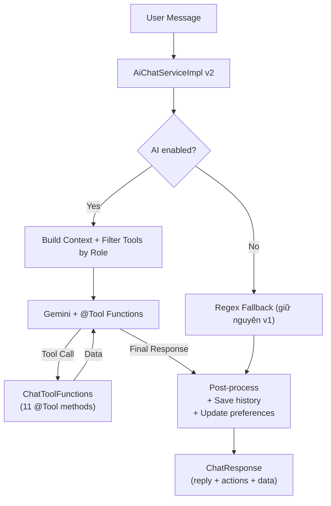
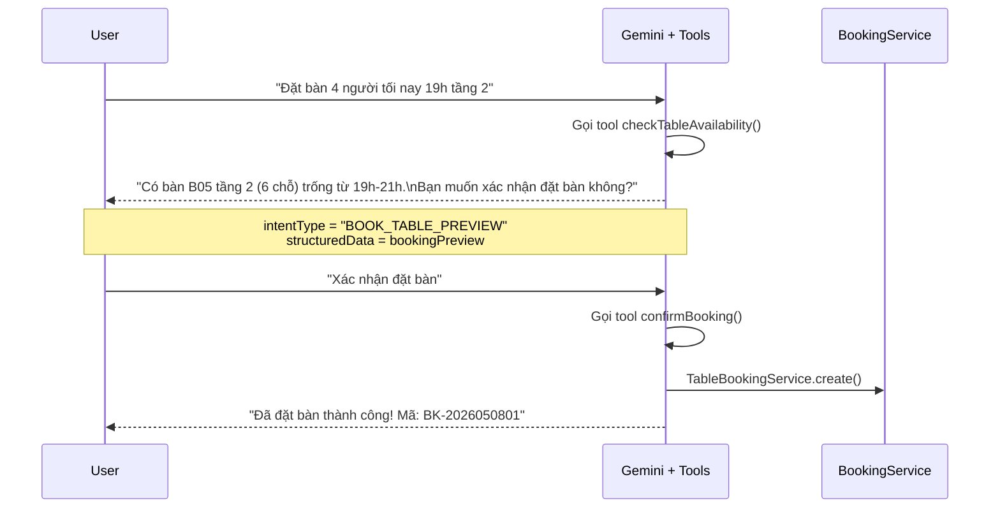

# 🚀 Kế Hoạch Nâng Cấp AI Chatbot v2.0 — CF Manager

> **Phiên bản:** v2.0 · **Ngày:** 2026-05-08 · **Scope:** BE only (cả 3 phase)  
> **Stack:** Spring Boot 3.5.12 · Spring AI 1.1.5 · Gemini · MySQL · Redis

---

## 1. Tóm Tắt Quyết Định

| Câu hỏi | Quyết định |
|----------|-----------|
| Spring AI version | Giữ **1.1.5** (stable, đã hỗ trợ `@Tool` + `@ToolParam`) |
| Giữ regex fallback | ✅ Giữ làm backup khi `chat.ai.enabled=false` hoặc quota exceeded |
| Booking qua chat | **2 bước**: AI trả preview → user gửi `confirm` → gọi `create()` |
| Scope | Triển khai **cả 3 phase cùng lúc** |
| Frontend | Chỉ focus BE. FE docs sẽ viết riêng |

---

## 2. Kiến Trúc Mới



### Flow Đặt Bàn (2 bước xác nhận)



---

## 3. Danh Sách File Thay Đổi

### 3.1. Files MỚI

| File | Mô tả |
|------|--------|
| `tools/ChatToolFunctions.java` | 11 `@Tool` methods wrapping existing services |
| `tools/ChatToolAuthFilter.java` | Lọc tool theo Authentication role |

### 3.2. Files SỬA

| File | Thay đổi |
|------|----------|
| `config/AiConfig.java` | Đăng ký system prompt vào `ChatClient.Builder` |
| `service/impl/AiChatServiceImpl.java` | Refactor: dùng `ChatClient.tools()` per-request thay vì regex switch |
| `dto/response/chat/ChatResponse.java` | Thêm `suggestedActions`, `structuredData` |

### 3.3. Files GIỮ NGUYÊN

| File | Lý do |
|------|-------|
| `controller/AiChatController.java` | API contract không đổi |
| `service/AiChatService.java` | Interface không đổi |
| `dto/request/chat/ChatRequest.java` | Request format giữ nguyên |
| `utils/chat/*.java` | Giữ làm regex fallback |
| `entity/ConversationMessage.java` | Schema không đổi |
| `entity/UserPreference.java` | Schema không đổi |
| `repository/native_interface/NativeSqlChatRepository.java` | Vẫn dùng cho tools |

---

## 4. Chi Tiết Code — Từng File

### 4.1. `ChatToolFunctions.java` (MỚI)

> [!IMPORTANT]
> Class này chứa tất cả `@Tool` methods. Spring AI auto-scan và tạo JSON schema cho Gemini.

```java
package com.duyminhdev.cf_manager.tools;

@Slf4j
@Component
@RequiredArgsConstructor
public class ChatToolFunctions {

    private final NativeSqlChatRepository chatRepo;
    private final DishService dishService;
    private final TableBookingService bookingService;
    private final DashboardService dashboardService;
    private final CafeInfoProperties cafeInfo;

    // ========== PUBLIC TOOLS ==========

    @Tool(description = "Kiểm tra bàn trống theo tầng và khung giờ. " +
          "Trả về danh sách bàn không có booking chồng lịch. " +
          "Dùng khi khách hỏi 'còn bàn trống không', 'bàn nào trống tối nay'.")
    public List<TableAvailabilityDTO> checkTableAvailability(
            @ToolParam(description = "Tầng cần kiểm tra, null nếu tất cả tầng") Integer floor,
            @ToolParam(description = "Thời gian bắt đầu, format ISO-8601 UTC") String startTime,
            @ToolParam(description = "Thời gian kết thúc, format ISO-8601 UTC") String endTime) {
        return chatRepo.findAvailableTables(floor, 
            Instant.parse(startTime), Instant.parse(endTime));
    }

    @Tool(description = "Lấy danh sách thực đơn quán cà phê gồm tên món, giá, danh mục. " +
          "Dùng khi khách hỏi 'có món gì', 'menu', 'giá bao nhiêu', 'gợi ý đồ uống'.")
    public List<DishResponseDTO> queryMenu() {
        DishListRequestDTO req = new DishListRequestDTO();
        req.setActive(true);
        return dishService.getAll(req);
    }

    @Tool(description = "Lấy top món bán chạy nhất trong khoảng thời gian. " +
          "Dùng khi hỏi 'món nào bán chạy nhất', 'gợi ý món phổ biến'.")
    public List<Object[]> getTopSellingDishes(
            @ToolParam(description = "Thời gian bắt đầu ISO-8601 UTC") String from,
            @ToolParam(description = "Thời gian kết thúc ISO-8601 UTC") String to,
            @ToolParam(description = "Số lượng món muốn lấy, mặc định 5") int limit) {
        return chatRepo.getTopSellingDishes(Instant.parse(from), Instant.parse(to), 
            limit > 0 ? limit : 5);
    }

    @Tool(description = "Lấy thông tin quán cà phê: tên, địa chỉ, giờ mở cửa, wifi, đỗ xe. " +
          "Dùng khi khách hỏi FAQ: 'mấy giờ mở cửa', 'ở đâu', 'có wifi không', 'pass wifi'.")
    public String getCafeInfo() {
        return cafeInfo.toSystemPromptSnippet();
    }

    // ========== STAFF TOOLS (sẽ được filter theo role) ==========

    @Tool(description = "Tạo preview đặt bàn (chưa xác nhận). Trả về thông tin bàn đề xuất. " +
          "Dùng khi nhân viên nói 'đặt bàn cho X người lúc Y'. " +
          "SAU KHI user xác nhận mới gọi confirmBooking().")
    public String previewBooking(
            @ToolParam(description = "Tên khách hàng") String customerName,
            @ToolParam(description = "Số điện thoại, null nếu không có") String phone,
            @ToolParam(description = "Số người") int guestCount,
            @ToolParam(description = "Tầng yêu thích, null nếu không chỉ định") Integer preferredFloor,
            @ToolParam(description = "Thời gian đến ISO-8601 UTC") String arriveTime,
            @ToolParam(description = "Thời gian trả bàn ISO-8601 UTC") String checkOutTime) {
        // Chỉ kiểm tra bàn trống, KHÔNG tạo booking
        List<TableAvailabilityDTO> available = chatRepo.findAvailableTables(
            preferredFloor, Instant.parse(arriveTime), Instant.parse(checkOutTime));
        if (available.isEmpty()) {
            return "KHÔNG CÒN BÀN TRỐNG cho khung giờ này.";
        }
        // Chọn bàn phù hợp nhất (slot >= guestCount)
        TableAvailabilityDTO best = available.stream()
            .filter(t -> t.getSlot() >= guestCount)
            .findFirst().orElse(available.get(0));
        
        return String.format("PREVIEW: Bàn %s (Tầng %d, %d chỗ) | Khách: %s | SĐT: %s | %d người | %s - %s. " +
            "HỎI KHÁCH XÁC NHẬN trước khi gọi confirmBooking().",
            best.getTableName(), best.getFloor(), best.getSlot(),
            customerName, phone != null ? phone : "N/A", guestCount,
            arriveTime, checkOutTime);
    }

    @Tool(description = "Xác nhận đặt bàn SAU KHI khách đã đồng ý preview. " +
          "CHỈ GỌI KHI khách nói 'xác nhận', 'ok', 'đồng ý'. KHÔNG tự ý gọi.")
    public String confirmBooking(
            @ToolParam(description = "Tên khách") String customerName,
            @ToolParam(description = "Số điện thoại") String phone,
            @ToolParam(description = "Số người") int guestCount,
            @ToolParam(description = "ID bàn đã chọn từ preview") Integer tableId,
            @ToolParam(description = "Thời gian đến ISO-8601 UTC") String arriveTime,
            @ToolParam(description = "Thời gian trả bàn ISO-8601 UTC") String checkOutTime) {
        try {
            TableBookingCreateRequestDTO req = new TableBookingCreateRequestDTO();
            req.setDiningTableId(tableId);
            req.setCustomerName(customerName);
            req.setCustomerPhone(phone);
            req.setGuestCount(guestCount);
            req.setExpectedArriveTime(Instant.parse(arriveTime));
            req.setExpectedCheckOut(Instant.parse(checkOutTime));
            
            TableBookingResponseDTO booking = bookingService.create(req);
            return "ĐẶT BÀN THÀNH CÔNG. Mã: " + booking.getBookingInvoiceCode();
        } catch (Exception e) {
            log.error("Booking failed", e);
            return "THẤT BẠI: " + e.getMessage();
        }
    }

    // ========== ADMIN/QL TOOLS ==========

    @Tool(description = "Xem tổng hợp doanh thu theo khoảng thời gian. " +
          "Trả về tổng tiền và số hóa đơn đã thanh toán.")
    public SalesSummaryDTO getSalesReport(
            @ToolParam(description = "Ngày bắt đầu ISO-8601 UTC") String from,
            @ToolParam(description = "Ngày kết thúc ISO-8601 UTC") String to) {
        return chatRepo.getSalesSummary(Instant.parse(from), Instant.parse(to));
    }

    @Tool(description = "Kiểm tra nguyên liệu sắp hết hoặc sắp hết hạn trong kho.")
    public List<IngredientStockDTO> checkInventory() {
        return chatRepo.getLowStockIngredients();
    }

    @Tool(description = "Lấy tổng quan KPI dashboard: doanh thu, đơn hàng, booking hôm nay.")
    public DashboardKpiDTO getDashboardKpi() {
        return dashboardService.getKpi();
    }

    @Tool(description = "Lấy cảnh báo tồn kho: nguyên liệu hết hạn sớm hoặc sắp hết.")
    public List<DashboardStockAlertItemDTO> getStockAlerts() {
        return dashboardService.getStockAlerts();
    }

    // ========== STAFF DASHBOARD TOOLS ==========

    @Tool(description = "Lấy danh sách booking sắp đến trong 2 giờ tới.")
    public List<DashboardUpcomingBookingItemDTO> getUpcomingBookings() {
        return dashboardService.getUpcomingBookings();
    }

    @Tool(description = "Lấy danh sách đơn hàng đang chế biến hôm nay.")
    public List<DashboardProcessingOrderItemDTO> getProcessingOrders() {
        return dashboardService.getProcessingOrdersToday();
    }
}
```

### 4.2. `ChatToolAuthFilter.java` (MỚI)

```java
package com.duyminhdev.cf_manager.tools;

@Component
@RequiredArgsConstructor
public class ChatToolAuthFilter {

    private final ChatToolFunctions chatToolFunctions;

    private static final Set<String> PUBLIC_TOOLS = Set.of(
        "checkTableAvailability", "queryMenu", "getTopSellingDishes", "getCafeInfo"
    );
    private static final Set<String> STAFF_TOOLS = Set.of(
        "previewBooking", "confirmBooking", "getUpcomingBookings", "getProcessingOrders"
    );
    private static final Set<String> ADMIN_TOOLS = Set.of(
        "getSalesReport", "checkInventory", "getDashboardKpi", "getStockAlerts"
    );

    /**
     * Trả về instance ChatToolFunctions nhưng chỉ expose các tool phù hợp role.
     * Spring AI sẽ scan toàn bộ @Tool methods, ta filter bằng ToolCallbackProvider.
     */
    public Object[] getToolsForAuth(Authentication auth) {
        // Cách tiếp cận: pass nguyên object, filter sẽ nằm trong system prompt
        // + Gemini tự biết chỉ gọi tool được phép.
        // Cách chắc chắn hơn: dùng ToolCallbackProvider.from() rồi filter.
        return new Object[]{ chatToolFunctions };
    }

    public Set<String> getAllowedToolNames(Authentication auth) {
        Set<String> allowed = new HashSet<>(PUBLIC_TOOLS);
        if (hasAnyRole(auth, "ADMIN", "QL", "PC", "PV")) {
            allowed.addAll(STAFF_TOOLS);
        }
        if (hasAnyRole(auth, "ADMIN", "QL")) {
            allowed.addAll(ADMIN_TOOLS);
        }
        if (hasAnyRole(auth, "ADMIN", "QL", "PC")) {
            allowed.add("checkInventory");
            allowed.add("getStockAlerts");
        }
        return allowed;
    }

    private boolean hasAnyRole(Authentication auth, String... roles) {
        if (auth == null) return false;
        return auth.getAuthorities().stream()
            .anyMatch(a -> Arrays.stream(roles)
                .anyMatch(r -> a.getAuthority().equals(r) || 
                              a.getAuthority().equals("ROLE_" + r)));
    }
}
```

### 4.3. `AiConfig.java` (SỬA)

```diff
 @Configuration
 public class AiConfig {

     @Value("${chat.ai.enabled:true}")
     private boolean aiEnabled;

     @Bean
-    public ChatClient chatClient(ChatClient.Builder builder) {
-        return builder.build();
+    public ChatClient chatClient(ChatClient.Builder builder, 
+                                  CafeInfoProperties cafeInfo) {
+        return builder
+            .defaultSystem(buildDefaultSystemPrompt(cafeInfo))
+            .build();
     }
+
+    private String buildDefaultSystemPrompt(CafeInfoProperties cafeInfo) {
+        return """
+            Bạn là trợ lý AI thông minh của quán cà phê "%s".
+            
+            QUY TẮC BẮT BUỘC:
+            1. Trả lời bằng tiếng Việt, thân thiện, lịch sự, ngắn gọn.
+            2. Khi cần dữ liệu (bàn trống, menu, doanh thu...), BẮT BUỘC gọi tool tương ứng.
+               KHÔNG BAO GIỜ bịa dữ liệu.
+            3. Nếu không có tool phù hợp, trả lời dựa trên thông tin quán đã cung cấp.
+            4. Với câu hỏi ngoài phạm vi quán cà phê, từ chối lịch sự.
+            5. Múi giờ quán: Asia/Ho_Chi_Minh (UTC+7). Khi gọi tool cần thời gian, 
+               chuyển đổi sang UTC. VD: 19h VN = 12:00 UTC.
+            6. Format số tiền: dấu phẩy ngăn hàng nghìn + hậu tố "VNĐ".
+            7. Khi đặt bàn: LUÔN gọi previewBooking() trước → hỏi xác nhận → 
+               CHỈ gọi confirmBooking() khi khách nói đồng ý.
+            
+            %s
+            """.formatted(cafeInfo.getName(), cafeInfo.toSystemPromptSnippet());
+    }
 }
```

### 4.4. `AiChatServiceImpl.java` (SỬA LỚN)

```java
// Refactored flow — giữ regex làm backup

@Override
@Transactional
public ChatResponse processChat(ChatRequest request, Authentication auth) {
    String message = request.getMessage().trim();
    String userId = resolveUserId(auth, request.getUserId());
    String sessionId = StringUtils.hasText(request.getSessionId()) 
        ? request.getSessionId() : UUID.randomUUID().toString();

    saveMessage(userId, sessionId, "user", message);

    String reply;
    String intentType = null;
    List<ChatResponse.SuggestedAction> actions = null;

    if (aiEnabled && System.currentTimeMillis() >= aiQuotaBackoffUntilMs) {
        // ===== V2: AI-driven with Tool Calling =====
        reply = callAIWithTools(message, userId, sessionId, auth);
    } else {
        // ===== V1 Fallback: Regex-based =====
        IntentType intent = detectIntent(message);
        intentType = intent.name();
        reply = handleByRegex(message, intent, auth);
    }

    if (!StringUtils.hasText(reply)) {
        reply = "Xin lỗi, tôi chưa hiểu ý bạn. Vui lòng thử lại.";
    }

    saveMessage(userId, sessionId, "assistant", reply);
    updateUserPreferences(userId, message, detectIntent(message));

    return ChatResponse.builder()
            .reply(reply)
            .sessionId(sessionId)
            .intentType(intentType)
            .timestamp(Instant.now())
            .suggestedActions(actions)
            .build();
}

private String callAIWithTools(String msg, String userId, String sessionId, 
                                Authentication auth) {
    try {
        // Build dynamic user prompt with context
        String userPrompt = buildUserPromptWithContext(msg, userId, sessionId);

        // Get allowed tools based on role
        Set<String> allowedTools = toolAuthFilter.getAllowedToolNames(auth);

        // Filter tool callbacks using ToolCallbackProvider
        ToolCallback[] filteredTools = ToolCallbackProvider.from(chatToolFunctions)
            .getToolCallbacks().stream()
            .filter(tc -> allowedTools.contains(tc.getToolDefinition().name()))
            .toArray(ToolCallback[]::new);

        return chatClient.prompt()
                .user(userPrompt)
                .tools(filteredTools)
                .call()
                .content();
    } catch (Exception e) {
        log.error("AI call with tools failed: {}", e.getMessage());
        if (isQuotaExceeded(e)) {
            aiQuotaBackoffUntilMs = System.currentTimeMillis() + quotaBackoffMs;
        }
        // Fallback to regex
        IntentType intent = detectIntent(msg);
        return handleByRegex(msg, intent, auth);
    }
}

private String handleByRegex(String message, IntentType intent, Authentication auth) {
    // Giữ nguyên logic v1 hiện tại
    return switch (intent) {
        case TABLE_AVAILABILITY -> handleTableAvailability(message);
        case BOOK_TABLE -> handleBookTable(message, auth);
        case MENU_QUERY -> null; // vẫn null, sẽ dùng hardFallback
        case SALES_REPORT -> handleSalesReport(message, auth);
        case INVENTORY_CHECK -> handleInventoryCheck(message, auth);
        case CREATE_PURCHASE_ORDER -> handleCreatePurchaseOrder(message, auth);
        case FAQ, UNKNOWN -> hardFallbackReply(intent);
    };
}

private String buildUserPromptWithContext(String message, String userId, String sessionId) {
    StringBuilder prompt = new StringBuilder();

    // User preferences
    preferenceRepo.findByUserId(userId).ifPresent(pref -> {
        prompt.append("SỞ THÍCH KHÁCH: ");
        if (pref.getPreferredTableFloor() != null)
            prompt.append("Thích tầng ").append(pref.getPreferredTableFloor()).append(". ");
        if (pref.getPreferredDishType() != null)
            prompt.append("Thích ").append(pref.getPreferredDishType()).append(". ");
        prompt.append("\n");
    });

    // Chat history (last 10 messages for context)
    List<ConversationMessage> history = conversationRepo
        .findTop10ByUserIdAndSessionIdOrderByCreatedAtAsc(userId, sessionId);
    if (!history.isEmpty()) {
        prompt.append("LỊCH SỬ CHAT:\n");
        for (ConversationMessage m : history) {
            prompt.append(m.getRole().equals("user") ? "Khách: " : "Bot: ")
                  .append(m.getContent()).append("\n");
        }
    }

    prompt.append("\nCâu hỏi hiện tại: ").append(message);
    return prompt.toString();
}
```

### 4.5. `ChatResponse.java` (SỬA)

```diff
 @Getter
 @Builder
 @AllArgsConstructor
 @NoArgsConstructor
 public class ChatResponse {
     private String reply;
     private String sessionId;
     @Builder.Default
     private Instant timestamp = Instant.now();
     @JsonInclude(JsonInclude.Include.NON_NULL)
     private String intentType;
+    
+    @JsonInclude(JsonInclude.Include.NON_NULL)
+    private List<SuggestedAction> suggestedActions;
+    
+    @JsonInclude(JsonInclude.Include.NON_NULL)
+    private Object structuredData;
 
     public ChatResponse(String reply, String sessionId) {
         this.reply = reply;
         this.sessionId = sessionId;
         this.timestamp = Instant.now();
     }
+    
+    @Getter
+    @Builder
+    @AllArgsConstructor
+    @NoArgsConstructor
+    public static class SuggestedAction {
+        private String label;   // "Xem menu", "Đặt bàn ngay"
+        private String action;  // "NAVIGATE:/menu", "CHAT:đặt bàn 4 người tối nay"
+    }
 }
```

---

## 5. Dependency — Không cần thay đổi

> [!NOTE]
> Spring AI 1.1.5 đã hỗ trợ đầy đủ `@Tool`, `@ToolParam`, `ToolCallbackProvider`. 
> **Không cần thay đổi pom.xml.**
> 
> Nếu gặp issue, có thể xem xét upgrade lên `1.1.6+` nếu có patch.

---

## 6. Checklist Triển Khai

- [ ] **Tạo** `tools/ChatToolFunctions.java` — 11 tool methods
- [ ] **Tạo** `tools/ChatToolAuthFilter.java` — role-based filtering
- [ ] **Sửa** `config/AiConfig.java` — system prompt vào ChatClient.Builder
- [ ] **Sửa** `service/impl/AiChatServiceImpl.java` — refactor sang tool-based + giữ regex fallback
- [ ] **Sửa** `dto/response/chat/ChatResponse.java` — thêm suggestedActions, structuredData
- [ ] **Verify** `TableBookingCreateRequestDTO` fields match tool params
- [ ] **Test** end-to-end: menu, bàn trống, đặt bàn 2 bước, doanh thu, FAQ
- [ ] **Test** regex fallback khi `chat.ai.enabled=false`
- [ ] **Test** quota exceeded → automatic fallback

---

## 7. Rủi Ro & Giảm Thiểu

| Rủi ro | Giảm thiểu |
|--------|-----------|
| Gemini gọi `confirmBooking()` mà không hỏi user | System prompt ràng buộc + tool description rõ ràng "CHỈ GỌI KHI khách đồng ý" |
| Gemini bịa dữ liệu thay vì gọi tool | System prompt: "KHÔNG BAO GIỜ bịa dữ liệu" + tool description đầy đủ |
| Quota exceeded → UX kém | Regex fallback tự động, backoff timer |
| `ToolCallbackProvider.from()` API thay đổi | Pin version 1.1.5, verify API trước khi code |

---

> [!IMPORTANT]
> Xin review checklist và code skeleton ở mục 4. Khi bạn approve, tôi sẽ bắt đầu code.
