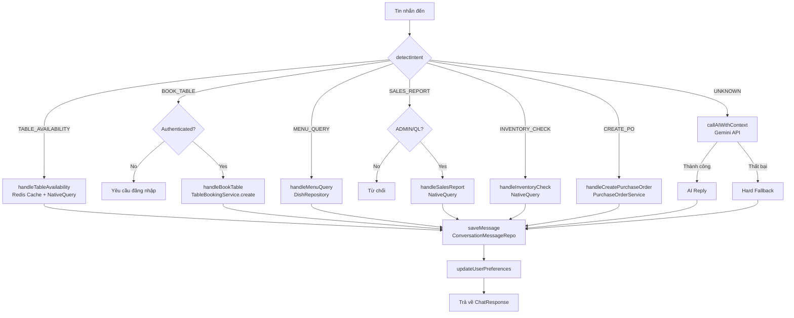

# Module AI Chatbot - Kế hoạch triển khai

Tích hợp trợ lý ảo AI (Gemini) vào hệ thống `cf-manager` hiện có. Module cung cấp 2 endpoint: `/api/v1/chat/public` (cho khách hàng, không xác thực) và `/api/v1/chat/staff` (cho nhân viên, yêu cầu JWT). Sử dụng kiến trúc Rule-based Intent Detection → AI Fallback (Gemini) → Hard Fallback, kết hợp Redis Cache và lịch sử hội thoại.

## Trạng thái môi trường

| Thành phần | Hiện trạng |
|---|---|
| Spring Boot | `3.5.12` |
| Spring AI BOM | `1.1.5` (đã có trong `pom.xml`) |
| `spring-ai-starter-model-google-genai` | ✅ Đã có trong `pom.xml` |
| Spring Data Redis | ✅ Đã có |
| Redisson | ✅ Đã có |
| WebSocket | ✅ Đã có |
| Redis port | `6380` (không phải 6379 mặc định) |

> [!IMPORTANT]
> Dependency Spring AI **đã được cấu hình sẵn** trong `pom.xml`. Chỉ cần bổ sung `GEMINI_API_KEY` vào `application.properties` và tạo `AiConfig.java`.

---

## Open Questions

> [!IMPORTANT]
> **[Q1] Sử dụng `RedisTemplate` hay `Redisson` để cache bàn trống?**
> Dự án hiện dùng Redisson cho distributed lock. Để nhất quán, tôi sẽ dùng `RedisTemplate<String, String>` (đã được Spring Data Redis tự cấu hình) cho cache chatbot — tránh ràng buộc thêm.

> [!IMPORTANT]
> **[Q2] Endpoint `/staff` phân quyền chi tiết theo chức năng?**
> Theo design: tất cả role ADMIN, QL, PC, PV đều truy cập `/staff`. Kiểm tra role cụ thể (VD: chỉ ADMIN/QL mới xem doanh thu) sẽ thực hiện bên trong service bằng `authentication.getAuthorities()`.

> [!IMPORTANT]  
> **[Q3] Thông tin quán cà phê trong system prompt?**
> Hiện design có placeholder `"Quán mở cửa 7h-22h, địa chỉ 123 Nguyễn Văn Linh..."`. Tôi sẽ tạo file config `cafe.info.*` trong `application.properties` để dễ chỉnh sửa. **Bạn cần cung cấp thông tin thực của quán trước hoặc sau khi tôi triển khai.**

---

## Proposed Changes

### Phần 1: Cấu hình & Dependency

#### [MODIFY] [application.properties](file:///d:/.DATN/CHUONG%20TRINH%20QUAN%20LY%20QUAN%20CAFE%20CF-M/CF-M/BE/src/main/resources/application.properties)
Thêm:
- `spring.ai.google.genai.api-key=${GEMINI_API_KEY}`
- `spring.ai.google.genai.chat.options.model=gemini-2.0-flash`
- `spring.ai.google.genai.chat.options.temperature=0.7`
- `chat.ai.enabled=true`, `chat.ai.quota-backoff-ms=300000`
- `chat.cache.table-availability-ttl-seconds=30`
- `cafe.info.*` (giờ mở cửa, địa chỉ, wifi, đỗ xe…)

#### [NEW] `AiConfig.java` — `config/`
Cung cấp `ChatClient` bean từ Spring AI.

#### [MODIFY] [SecurityConfig.java](file:///d:/.DATN/CHUONG%20TRINH%20QUAN%20LY%20QUAN%20CAFE%20CF-M/CF-M/BE/src/main/java/com/duyminhdev/cf_manager/config/SecurityConfig.java)
Thêm `/api/v1/chat/public` vào `WHITE_LIST_URL`.

---

### Phần 2: Entity & DB Migration

#### [NEW] `ConversationMessage.java` — `entity/`
Lưu lịch sử hội thoại (`conversation_messages`): `userId`, `sessionId`, `role`, `content`, `createdAt`.

#### [NEW] `UserPreference.java` — `entity/`
Lưu sở thích người dùng (`user_preferences`): `userId`, `preferredDishType`, `preferredTableFloor`, `preferredPriceRange`, `totalBookings`, `notes`, `updatedAt`.

#### [NEW] SQL Migration Script — `resources/sql/`
Script `V_chatbot_tables.sql` tạo 2 bảng mới.

---

### Phần 3: Repository

#### [NEW] `ConversationMessageRepository.java` — `repository/`
`findTop10ByUserIdAndSessionIdOrderByCreatedAtAsc(userId, sessionId)`

#### [NEW] `UserPreferenceRepository.java` — `repository/`
`findByUserId(userId)` + `save()`.

#### [NEW] `NativeSqlChatRepository.java` — `repository/native_interface/`
Interface định nghĩa các native query cho chatbot:
- `findAvailableTables(floor, start, end)` → `List<TableAvailabilityDTO>`
- `getSalesSummary(from, to)` → `SalesSummaryDTO`
- `getLowStockIngredients()` → `List<IngredientStockDTO>`

#### [NEW] `NativeSqlChatRepositoryImpl.java` — `repository/native_interface/impl/`
Implementation dùng `EntityManager` + `Tuple.class`, pattern giống `NativeSqlTableBookingRepositoryImpl`.

---

### Phần 4: DTO

#### [NEW] `ChatRequest.java` — `dto/request/chat/`
```java
String message, String sessionId, String userId
```

#### [NEW] `ChatResponse.java` — `dto/response/chat/`
```java
String reply, String sessionId, Instant timestamp
```

#### [NEW] `TableAvailabilityDTO.java` — `dto/db_result/native_sql/`
Kết quả bàn trống từ native query.

#### [NEW] `SalesSummaryDTO.java` — `dto/db_result/native_sql/`
Tổng doanh thu + số hóa đơn.

#### [NEW] `IngredientStockDTO.java` — `dto/db_result/native_sql/`
Nguyên liệu sắp hết / sắp hết hạn.

---

### Phần 5: Helper Classes

#### [NEW] `TableQueryParser.java` — `utils/chat/`
Regex parser trích xuất: tầng, ngày, giờ bắt đầu/kết thúc từ tin nhắn tiếng Việt.

Patterns ví dụ:
- `tầng (\d+)` → floor
- `(hôm nay|ngày mai|\d{1,2}/\d{1,2})` → date
- `(\d{1,2}h\d{0,2}|\d{1,2}:\d{2})` → time

#### [NEW] `BookingParser.java` — `utils/chat/`
Regex parser cho đặt bàn: tên khách, SĐT, thời gian, số người, tầng.

#### [NEW] `ChatTimeUtils.java` — `utils/chat/`
Xử lý múi giờ `Asia/Ho_Chi_Minh` → UTC `Instant`.

---

### Phần 6: Service Layer

#### [NEW] `AiChatService.java` — `service/`
```java
ChatResponse processChat(ChatRequest request, Authentication authentication)
```

#### [NEW] `AiChatServiceImpl.java` — `service/impl/`
Core logic:
1. `detectIntent(message)` → rule-based regex → `IntentType` enum
2. Switch-case dispatch → handler tương ứng
3. Handler gọi native query / service hiện có
4. Fallback `callAIWithContext()` → Gemini
5. Hard fallback → thông báo lỗi
6. `saveMessage()` → persist lịch sử
7. `updateUserPreferences()` → cập nhật sở thích

**Intent handlers:**
- `handleTableAvailability()` → Redis cache + `NativeSqlChatRepository`
- `handleBookTable()` → `TableBookingService.create()` (chỉ khi authenticated)
- `handleMenuQuery()` → `DishRepository` trực tiếp
- `handleSalesReport()` → `NativeSqlChatRepository.getSalesSummary()` (chỉ ADMIN/QL)
- `handleInventoryCheck()` → `NativeSqlChatRepository.getLowStockIngredients()`
- `handleCreatePurchaseOrder()` → parse + `PurchaseOrderService.create()` (chỉ ADMIN/QL)

---

### Phần 7: Controller

#### [NEW] `AiChatController.java` — `controller/`
```java
POST /api/v1/chat/public   → publicChat()   // permitAll
POST /api/v1/chat/staff    → staffChat()    // @PreAuthorize("hasAnyRole('ADMIN','QL','PC','PV')")
```
Trả về `ApiResponse<ChatResponse>` theo pattern hiện tại.

---

## Sơ đồ luồng xử lý



---

## Thứ tự file cần tạo

1. `application.properties` (bổ sung config)
2. SQL migration script
3. `ConversationMessage.java`, `UserPreference.java`
4. `ConversationMessageRepository.java`, `UserPreferenceRepository.java`
5. DTO classes (Request/Response/DB)
6. `NativeSqlChatRepository.java` + `Impl`
7. Helper utils (`TableQueryParser`, `BookingParser`, `ChatTimeUtils`)
8. `AiChatService.java` + `AiChatServiceImpl.java`
9. `AiConfig.java`
10. `AiChatController.java`
11. `SecurityConfig.java` (thêm whitelist)

---

## Verification Plan

### Automated (Manual Test via Postman/curl)
```bash
# Test public endpoint
POST /api/v1/chat/public
{ "message": "Quán có những loại trà nào?", "sessionId": "test-001" }

# Test staff endpoint (với JWT)
POST /api/v1/chat/staff
Authorization: Bearer <token>
{ "message": "Doanh thu hôm nay được bao nhiêu?" }

# Test bàn trống
POST /api/v1/chat/public
{ "message": "Tầng 2 còn bàn trống tối nay từ 19h đến 21h không?" }
```

### Kiểm tra thủ công
- Spring AI bean tự động detect `GEMINI_API_KEY` từ env
- Redis cache bàn trống (TTL 30s)
- Fallback khi Gemini không khả dụng
- Không cho phép xem doanh thu khi dùng `/public`
