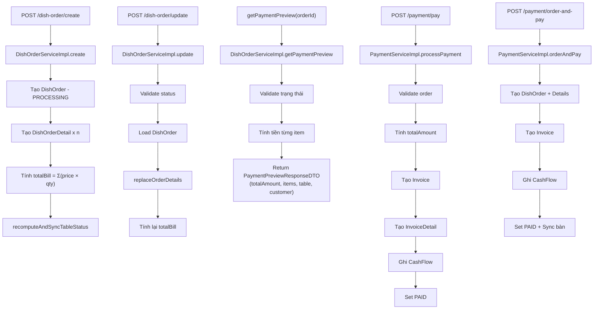
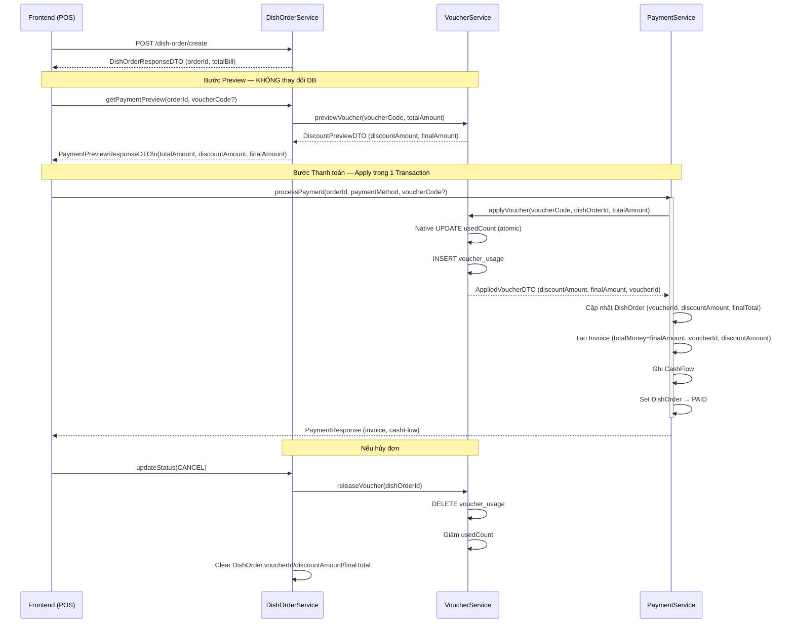

# Kế hoạch tích hợp Voucher — CF-M (v2 · đã cập nhật theo review)

---

## 1. Tổng quan luồng Đặt Món hiện tại



> **Vấn đề cốt lõi**: Toàn bộ luồng tính tiền cứng `totalBill = Σ (dish.price × qty)`, không có bước nào xử lý discount.

---

## 2. Danh sách API hiện có

### DishOrderController — `/api/v1/dish-order`

| Method | Endpoint | Request DTO | Response |
|---|---|---|---|
| POST | `/create` | `DishOrderCreateRequestDTO` | `DishOrderResponseDTO` |
| POST | `/update` | `DishOrderUpdateRequestDTO` | `DishOrderResponseDTO` |
| POST | `/update-status` | `DishOrderStatusUpdateRequestDTO` | `Boolean` |
| POST | `/list-by-table` | `DishOrderListByTableRequestDTO` | `List<DishOrderResponseDTO>` |
| POST | `/order-history` | `OrderHistorySearchRequestDTO` | `PageResponse<List<OrderHistoryResponseDTO>>` |
| POST | `/order-history/export` | `OrderHistorySearchRequestDTO` | Excel file |
| POST | `/dishes-for-pos-order-dishes` | `DishSearchRequestDTO` | `PageResponse<List<DishSearchNativeResultDTO>>` |

### PaymentController

| Method | Endpoint | Mô tả |
|---|---|---|
| POST | `/payment/preview` | Xem trước tổng tiền (→ tích hợp preview voucher) |
| POST | `/payment/pay` | Thanh toán đơn đã tạo (→ tích hợp apply voucher) |
| POST | `/payment/order-and-pay` | Tạo order và thanh toán luôn (→ tích hợp apply voucher) |

---

## 3. Cấu trúc Entity liên quan (hiện tại)

```
DishOrder
 ├── id
 ├── note
 ├── createdTime
 ├── totalBill         ← tổng tiền gốc (chưa có discount)
 ├── active
 ├── status            → DishOrderStatus
 ├── table             → TableEntity
 └── account           → Account

DishOrderDetail
 ├── dishOrder (FK)
 ├── dish (FK)
 ├── quantity
 ├── price             ← thành tiền dòng (qty × dish.price)
 └── note

Invoice
 ├── invoiceCode
 ├── totalMoney        ← tổng tiền (CHƯA có discount)
 ├── paymentStatus / paymentMethod
 ├── dishOrder (FK)
 └── ...
```

---

## 4. Chiến lược tích hợp Voucher (đã cập nhật theo review)

### 4.1 · Tách **Preview** và **Apply** — tránh tiêu hao lượt dùng oan

> **Issue gốc**: Một method `applyVoucher` duy nhất vừa tính discount vừa tăng `usedCount`.  
> Nếu gọi ở bước preview → lượt dùng bị trừ dù khách chưa thanh toán.

**Giải pháp — 2 method độc lập:**

```java
public interface VoucherService {

    /**
     * Chỉ kiểm tra hợp lệ + tính discount. KHÔNG thay đổi DB.
     * Gọi ở bước getPaymentPreview.
     */
    DiscountPreviewDTO previewVoucher(String code, BigDecimal totalAmount);

    /**
     * Thực sự đánh dấu sử dụng voucher (tăng usedCount + ghi voucher_usage).
     * Chỉ gọi khi thanh toán thành công, trong cùng @Transactional với Invoice.
     */
    AppliedVoucherDTO applyVoucher(String code, Integer dishOrderId, BigDecimal totalAmount);
}
```

| Method | Khi nào gọi | Tác động DB |
|---|---|---|
| `previewVoucher` | `getPaymentPreview` | ❌ Không |
| `applyVoucher` | `processPayment` / `orderAndPay` | ✅ Tăng `usedCount`, ghi `voucher_usage` |

---

### 4.2 · Gắn Voucher vào `DishOrder` — không chỉ `Invoice`

> **Issue gốc**: Plan v1 chỉ lưu thông tin voucher vào `Invoice`.  
> Nhưng voucher được áp cho **đơn hàng** — `DishOrder` mới là nguồn gốc dữ liệu.

**Columns bổ sung vào `DishOrder`:**

| Column | Kiểu | Ý nghĩa |
|---|---|---|
| `voucher_id` | INT FK NULL | Liên kết tới `voucher` |
| `discount_amount` | DECIMAL(18,2) | Số tiền được giảm |
| `final_total` | DECIMAL(18,2) | `totalBill - discount_amount` |

- `totalBill` **giữ nguyên** = tổng tiền gốc (không đổi).
- `discountAmount` = số tiền giảm theo voucher.
- `finalTotal` = số tiền khách thực trả.

**Lợi ích:**
- Các API như `list-by-table` hiển thị đúng tiền sau giảm.
- Rollback voucher khi hủy đơn có thể tra ngược qua `DishOrder.voucherId`.
- `Invoice` lấy snapshot từ `DishOrder` (hoặc lưu riêng để query nhanh).

---

### 4.3 · Atomicity — Voucher trong cùng transaction

> `applyVoucher` (tăng `usedCount` + ghi `voucher_usage`) phải nằm trong **cùng transaction** với `Invoice` và `CashFlow`.  
> ❌ Không dùng `@Transactional(propagation = REQUIRES_NEW)` cho voucher.  
> ✅ Dùng `@Transactional` trên `processPayment` — mọi thao tác cùng rollback nếu thất bại.

---

### 4.4 · Bảng `voucher_usage` — lịch sử sử dụng

> **Issue gốc**: Chỉ tăng `usedCount` — không có cách truy vết voucher đã áp cho đơn nào.

```sql
CREATE TABLE voucher_usage (
    id           INT          PRIMARY KEY AUTO_INCREMENT,
    voucher_id   INT          NOT NULL,
    dish_order_id INT         NOT NULL,
    account_id   INT          NOT NULL,       -- nhân viên thao tác
    discount_amount DECIMAL(18,2),
    used_at      DATETIME     NOT NULL,
    FOREIGN KEY (voucher_id)    REFERENCES voucher(id),
    FOREIGN KEY (dish_order_id) REFERENCES dish_order(id),
    FOREIGN KEY (account_id)    REFERENCES account(id),
    UNIQUE KEY uq_voucher_order (voucher_id, dish_order_id)  -- 1 voucher / 1 đơn
);
```

- `usedCount` trong `voucher` có thể **tính lại** từ bảng này bất cứ lúc nào.
- Là cơ sở để rollback: khi hủy đơn → xóa bản ghi `voucher_usage` + giảm `usedCount`.

---

### 4.5 · Snapshot trên `Invoice` — dùng cả `voucher_id` và `voucher_code`

> **Issue gốc**: Nếu chỉ lưu `voucherCode` (string) → khi voucher bị xóa rồi tạo lại cùng mã, không thể truy vết chính xác.

**Columns bổ sung vào `Invoice`:**

| Column | Kiểu | Ý nghĩa |
|---|---|---|
| `voucher_id` | INT FK NULL | FK tới `voucher` (có thể NULL nếu không dùng) |
| `voucher_code` | VARCHAR(50) NULL | Snapshot mã để hiển thị nhanh |
| `discount_amount` | DECIMAL(18,2) | Snapshot số tiền giảm |

---

### 4.6 · Race condition — tránh vượt `usageLimit`

> **Issue**: Nhiều đơn đồng thời áp cùng một voucher → `usedCount` vượt `usageLimit`.

**Giải pháp: Native UPDATE với điều kiện nguyên tử:**

```sql
UPDATE voucher
SET    used_count = used_count + 1
WHERE  id = :id
  AND  used_count < usage_limit
  AND  is_active = 1
  AND  NOW() BETWEEN start_date AND end_date;
```

- Nếu `affectedRows == 0` → voucher đã hết lượt / hết hạn → throw `InvalidDataException`.
- Thêm `@Version` vào entity `Voucher` để hỗ trợ optimistic lock tầng JPA nếu cần.

---

### 4.7 · Hoàn voucher khi hủy đơn

> Khi `updateStatus` chuyển sang `CANCEL`, nếu đơn đã dùng voucher → phải hoàn trả.

**Logic trong `DishOrderServiceImpl.updateStatus`:**

```
Nếu newStatus == CANCEL:
    └─ Load DishOrder
    └─ Nếu DishOrder.voucherId != null:
        └─ Xóa bản ghi voucher_usage (WHERE dish_order_id = ?)
        └─ Giảm voucher.usedCount (native UPDATE, đảm bảo >= 0)
        └─ Clear DishOrder.voucherId, discountAmount, finalTotal
        └─ Save DishOrder
```

---

## 5. Flow mới sau khi tích hợp (Sequence Diagram)



---

## 6. Danh sách file cần tạo / sửa

### 🆕 File mới

| File | Loại | Mô tả |
|---|---|---|
| `entity/Voucher.java` | Entity | Bảng `voucher` (có `@Version` cho optimistic lock) |
| `entity/VoucherUsage.java` | Entity | Bảng `voucher_usage` — lịch sử dùng voucher |
| `repository/VoucherRepository.java` | Repository | `findByCodeAndActiveTrue`, native UPDATE usedCount |
| `repository/VoucherUsageRepository.java` | Repository | `deleteByDishOrderId`, `existsByVoucherAndDishOrder` |
| `service/VoucherService.java` | Interface | `previewVoucher`, `applyVoucher`, `releaseVoucher` |
| `service/impl/VoucherServiceImpl.java` | Impl | Logic validate, tính discount, atomic update |
| `controller/VoucherController.java` | Controller | CRUD voucher cho admin |
| `dto/request/voucher/VoucherCreateRequestDTO.java` | DTO | Tạo voucher mới |
| `dto/request/voucher/VoucherUpdateRequestDTO.java` | DTO | Cập nhật voucher |
| `dto/response/voucher/VoucherResponseDTO.java` | DTO | Response danh sách / chi tiết voucher |
| `dto/response/voucher/DiscountPreviewDTO.java` | DTO | `discountAmount`, `finalAmount`, `voucherCode` |
| `dto/response/voucher/AppliedVoucherDTO.java` | DTO | Kết quả sau khi apply (kèm `voucherId`) |
| `enums/DiscountTypeEnum.java` | Enum | `PERCENT` / `FIXED` |

### ✏️ File cần sửa

| File | Thay đổi |
|---|---|
| `entity/DishOrder.java` | Thêm `voucher` (FK), `discountAmount`, `finalTotal` |
| `entity/Invoice.java` | Thêm `voucher` (FK NULL), `voucherCode`, `discountAmount` |
| `dto/response/payment/PaymentPreviewResponseDTO.java` | Thêm `discountAmount`, `finalAmount`, `voucherCode` |
| `dto/response/payment/InvoiceDto.java` | Thêm `voucherId`, `voucherCode`, `discountAmount` |
| `dto/request/payment/PaymentRequestDTO.java` | Thêm `voucherCode` (optional) |
| `dto/request/payment/OrderAndPayRequestDTO.java` | Thêm `voucherCode` (optional) |
| `service/DishOrderService.java` | Cập nhật signature `getPaymentPreview` nhận `voucherCode` |
| `service/impl/DishOrderServiceImpl.java` | Inject `VoucherService`, gọi `previewVoucher` trong `getPaymentPreview` |
| `service/impl/PaymentServiceImpl.java` | Inject `VoucherService`, gọi `applyVoucher` trong `processPayment` và `orderAndPay` |
| `service/impl/DishOrderServiceImpl.updateStatus` | Gọi `releaseVoucher` khi chuyển sang `CANCEL` |

---

## 7. Lộ trình triển khai — 10 bước

| # | Bước | Mô tả | Ghi chú |
|---|---|---|---|
| 1 | **Entity `Voucher` + SQL migration** | Bảng `voucher` với đầy đủ cột, thêm `@Version` | Nền tảng |
| 2 | **`VoucherRepository`** | `findByCodeAndActiveTrue`, native UPDATE atomic | Cần native query |
| 3 | **`VoucherService` + `VoucherServiceImpl`** | `previewVoucher` (read-only), `applyVoucher` (write), `releaseVoucher` (rollback) | Logic cốt lõi |
| 4 | **Entity `VoucherUsage` + migration** | Bảng `voucher_usage`, unique constraint | Audit trail |
| 5 | **`VoucherController`** | CRUD admin: tạo, sửa, xem danh sách, vô hiệu hóa | Quản lý voucher |
| 6 | **Sửa `DishOrder` entity + migration** | Thêm `voucher_id` FK, `discount_amount`, `final_total` | Gắn kết nguồn gốc |
| 7 | **Sửa `getPaymentPreview`** | Nhận `voucherCode`, gọi `previewVoucher`, trả thêm discount fields | Không write DB |
| 8 | **Sửa `processPayment` & `orderAndPay`** | Gọi `applyVoucher` trong `@Transactional`, cập nhật `DishOrder` + `Invoice` | Atomic |
| 9 | **Sửa `Invoice` entity + `InvoiceDto`** | Thêm `voucher_id`, `voucher_code`, `discount_amount` snapshot | Truy vết hóa đơn |
| 10 | **Hoàn voucher khi hủy đơn** | Trong `updateStatus(CANCEL)`: gọi `releaseVoucher` | Nghiệp vụ rollback |

---

## 8. Các tình huống biên cần xử lý (unit test)

| Tình huống | Kết quả mong đợi |
|---|---|
| Voucher không tồn tại | `InvalidDataException` |
| Voucher hết hạn (`endDate` < now) | `InvalidDataException` |
| Voucher chưa đến ngày áp dụng | `InvalidDataException` |
| Voucher hết lượt (`usedCount >= usageLimit`) | `InvalidDataException` (native UPDATE return 0 rows) |
| Đơn hàng không đủ `minOrderAmount` | `InvalidDataException` |
| Voucher `PERCENT` có `maxDiscount` | Discount = min(value%, maxDiscount) |
| Gọi `previewVoucher` nhiều lần | `usedCount` không tăng |
| Hủy đơn sau khi đã apply voucher | `usedCount` giảm, `voucher_usage` xóa |
| 2 request đồng thời cùng voucher cuối | Chỉ 1 thành công, 1 throw lỗi hết lượt |
