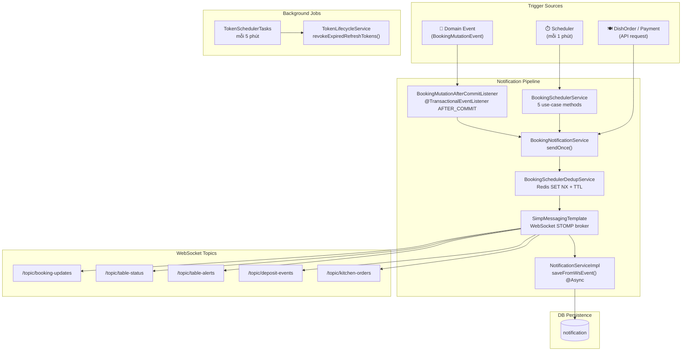

# Phân tích: Hệ thống Notification & Background Jobs

## Tổng quan kiến trúc

Hệ thống CF-M sử dụng **hai cơ chế gửi thông báo thời gian thực** kết hợp với **hai loại background job** để tự động hóa vòng đời của table booking.



---

## Phần 1: Notification System (WebSocket STOMP)

### 1.1 Kênh truyền thông: WebSocket STOMP

**File:** `WebSocketConfig.java`

| Config | Giá trị | Ý nghĩa |
|--------|---------|---------|
| Endpoint | `/ws` | Client kết nối tới đây (dùng SockJS fallback) |
| Broker prefix | `/topic`, `/queue` | Prefix các topic publish-subscribe |
| App prefix | `/app` | Prefix để client gửi message lên server |
| User prefix | `/user` | Prefix cho user-specific message |

> [!NOTE]
> Dùng `enableSimpleBroker` (in-memory), không cần RabbitMQ/ActiveMQ. Phù hợp cho deployment đơn server.

---

### 1.2 Luồng gửi thông báo: `BookingNotificationService`

**Interface:** `sendOnce(topic, dedupKey, payload)`

**Implementation** (`BookingNotificationServiceImpl`):

```
sendOnce()
  ├─ [1] Kiểm tra Dedup key trong Redis
  │       ├─ Nếu key đã tồn tại → RETURN (skip, tránh gửi trùng)
  │       └─ Nếu chưa có → SET key với TTL 45 phút, tiếp tục
  ├─ [2] normalizePayload() — chuẩn hóa envelope
  │       ├─ Thêm field "event" (alias của "eventType")
  │       ├─ Thêm field "at" (alias của "occurredAt" hoặc Instant.now())
  │       ├─ Thêm "topic", "dedupKey"
  │       └─ Sinh "eventId" = UUID mới
  └─ [3] messagingTemplate.convertAndSend(topic, envelope)
```

**Cấu trúc payload mẫu gửi lên WebSocket:**
```json
{
  "event": "TABLE_RESERVED",
  "message": "Bàn T5 được giữ chỗ trước 30 phút — khách sắp đến",
  "source": "SCHEDULER",
  "bookingId": 42,
  "bookingStatus": "CONFIRMED",
  "tableId": 5,
  "tableCode": "T5",
  "expectedArriveTime": "2026-05-09T10:30:00Z",
  "at": "2026-05-09T10:00:00Z",
  "topic": "/topic/table-status",
  "dedupKey": "booking:scheduler:reserve:42",
  "eventId": "f47ac10b-58cc-4372-a567-0e02b2c3d479"
}
```

> [!NOTE]
> Tất cả field `message` đã được chuẩn hóa sang **Tiếng Việt** kể từ phiên bản này. Message có tính động — chứa mã bàn, số phút, booking ID thực tế tại thời điểm gửi.

**Bảng format message theo event:**

| Event | Format message (Tiếng Việt) | Nguồn |
|-------|----------------------------|-------|
| `TABLE_RESERVED` | `"Bàn {tableCode} được giữ chỗ trước 30 phút — khách sắp đến"` | Scheduler |
| `BOOKING_EXPIRED_NO_SHOW` | `"Booking #{id} đã hết hạn — khách không check-in đúng giờ"` | Scheduler |
| `TABLE_OCCUPIED_CONFLICT` | `"Bàn {tableCode} đang có khách nhưng có booking xác nhận đến trong {X} phút — vui lòng giải quyết"` | Scheduler |
| `NO_ORDER_AUTO_CANCELLED` | `"Booking #{id} tự động hủy — khách check-in {X} phút chưa gọi món"` | Scheduler |
| `NO_ORDER_WARNING` | `"Khách bàn {tableCode} check-in được {X} phút nhưng chưa gọi món"` | Scheduler |
| `CHECKOUT_REMINDER` | `"Bàn {tableCode} sắp đến giờ checkout — còn {X} phút"` | Scheduler |
| `CHECKOUT_OVERDUE` | `"Bàn {tableCode} quá giờ checkout {X} phút — vui lòng xử lý thanh toán"` | Scheduler (mỗi 2 phút) |
| `BOOKING_CREATED` | `"Booking #{id} được tạo mới tại bàn {tableCode}"` | Mutation |
| `BOOKING_CONFIRMED` | `"Booking #{id} đã được xác nhận — bàn {tableCode}"` | Mutation |
| `BOOKING_CHECKED_IN` | `"Khách đã check-in booking #{id} tại bàn {tableCode}"` | Mutation |
| `BOOKING_CHECKED_OUT` | `"Khách đã check-out booking #{id} — bàn {tableCode} trống"` | Mutation |
| `BOOKING_CANCELLED` | `"Booking #{id} đã bị hủy — bàn {tableCode} trống"` | Mutation |
| `BOOKING_EXPIRED` | `"Booking #{id} đã hết hạn"` | Mutation |
| `BOOKING_EXTENDED` | `"Booking #{id} được gia hạn thêm giờ"` | Mutation |
| `BOOKING_WALK_IN_CREATED` | `"Khách vãng lai ngồi bàn {tableCode} (booking #{id})"` | Mutation |
| `BOOKING_LATE_ARRIVAL_WALK_IN_CREATED` | `"Khách đến muộn — walk-in bàn {tableCode} (booking #{id})"` | Mutation |
| `BOOKING_AUTO_CANCELLED_NO_ORDER` | `"Booking #{id} tự động hủy — không gọi món"` | Mutation |
| `BOOKING_DEPOSIT_PAID` | `"Booking #{id} đã thanh toán tiền cọc"` | Mutation |
| `ORDER_CREATED` | `"Order mới tại bàn {tableCode} — {N} món"` | DishOrder API |
| `ORDER_READY` | `"Món sẵn sàng lên bàn {tableCode}"` | DishOrder API |
| `ORDER_CANCELLED` | `"Order bàn {tableCode} bị hủy"` | DishOrder API |
| `PAYMENT_COMPLETED` | `"Thanh toán thành công bàn {tableCode} — {invoiceCode}"` | Payment API |
| `PAYMENT_FAILED` | `"Thanh toán thất bại bàn {tableCode} — {reason}"` | Payment API |

---

### 1.3 Dedup bằng Redis

**File:** `BookingSchedulerDedupService.java`

```java
stringRedisTemplate.opsForValue().setIfAbsent(key, "1", ttl)
// Redis: SET key "1" NX EX ttl
```

- **Mục đích:** Đảm bảo mỗi notification chỉ gửi đúng một lần trong cửa sổ TTL = **45 phút**
- **Fallback:** Nếu Redis lỗi → `return true` (cho phép gửi) để không block notification
- **Prefix keys** (trong `BookingSchedulerConstant`):

| Key Prefix | Dùng khi nào |
|-----------|-------------|
| `booking:scheduler:reserve:{id}` | Bàn được đặt trước 30 phút |
| `booking:scheduler:no-show:{id}` | Booking hết hạn no-show |
| `booking:scheduler:occupied-conflict:{id}` | Bàn đang bận nhưng có booking sắp tới |
| `booking:scheduler:no-order-warn:{id}` | Khách check-in 10 phút chưa order |
| `booking:scheduler:no-order-cancel:{id}` | Booking bị hủy vì 20 phút không order |
| `booking:scheduler:checkout-reminder:{id}` | Nhắc checkout trong 15 phút |
| `booking:scheduler:checkout-overdue:{id}:{window}` | Overdue nhắc lại mỗi 2 phút (`window = epoch/120`) |
| `booking:mutation:booking:{type}:{id}:{tableId}:{at}` | Mutation sự kiện real-time |
| `booking:mutation:table:{type}:{id}:{tableId}:{at}` | Đồng bộ trạng thái bàn |
| `booking:mutation:deposit:{type}:{id}:{tableId}:{at}` | Sự kiện đặt cọc |
| `order:kitchen:created:{orderId}` | Order mới tạo → bếp nhận |
| `order:kitchen:ready:{orderId}` | Bếp hoàn thành món |
| `order:kitchen:cancelled:{orderId}` | Order bị hủy giữa chừng |
| `payment:completed:{invoiceId}` | Thanh toán hoàn tất |

---

### 1.4 Nguồn phát sự kiện 1: Domain Event (sau khi commit DB)

**File:** `BookingMutationAfterCommitListener.java`

**Trigger:** Mỗi khi service layer gọi `BookingDomainEventPublisher.publish()`, sau khi transaction commit thành công (`@TransactionalEventListener(phase = AFTER_COMMIT)`).

**13 loại mutation → 3 topic nhận:**

| Mutation | Event Name | Topic(s) |
|----------|-----------|----------|
| `CREATE` | `BOOKING_CREATED` | `/topic/booking-updates` + `/topic/table-status` |
| `UPDATE` | `BOOKING_UPDATED` | `/topic/booking-updates` + `/topic/table-status` |
| `UPDATE_STATUS` | `BOOKING_STATUS_UPDATED` | `/topic/booking-updates` + `/topic/table-status` |
| `CONFIRM` | `BOOKING_CONFIRMED` | `/topic/booking-updates` + `/topic/table-status` |
| `CHECK_IN` | `BOOKING_CHECKED_IN` | `/topic/booking-updates` + `/topic/table-status` |
| `CHECK_OUT` | `BOOKING_CHECKED_OUT` | `/topic/booking-updates` + `/topic/table-status` |
| `CANCEL` | `BOOKING_CANCELLED` | `/topic/booking-updates` + `/topic/table-status` |
| `EXPIRE` | `BOOKING_EXPIRED` | `/topic/booking-updates` + `/topic/table-status` |
| `EXTEND` | `BOOKING_EXTENDED` | `/topic/booking-updates` + `/topic/table-status` |
| `WALK_IN` | `BOOKING_WALK_IN_CREATED` | `/topic/booking-updates` + `/topic/table-status` |
| `LATE_ARRIVAL_WALK_IN` | `BOOKING_LATE_ARRIVAL_WALK_IN_CREATED` | `/topic/booking-updates` + `/topic/table-status` |
| `CANCEL_NO_ORDER_TIMEOUT` | `BOOKING_AUTO_CANCELLED_NO_ORDER` | `/topic/booking-updates` + `/topic/table-status` |
| `DEPOSIT` | `BOOKING_DEPOSIT_UPDATED` + `BOOKING_DEPOSIT_PAID` | `/topic/booking-updates` + `/topic/deposit-events` |

> [!IMPORTANT]
> Mutation `DEPOSIT` **không** publish lên `/topic/table-status` vì thanh toán cọc không làm thay đổi trạng thái bàn.

---

### 1.5 Nguồn phát sự kiện 2: Scheduler polling

**File:** `BookingSchedulerService.java`

---

## Phần 2: Background Jobs (Scheduled Tasks)

### 2.1 Booking Scheduler (mỗi 1 phút)

**File:** `BookingSchedulerTasks.java`

```
@ConditionalOnProperty("booking.scheduler.enabled") — có thể tắt qua config
@Scheduled(cron = "0 * * * * *") — chạy đúng phút 0 giây mỗi phút
@SchedulerLock (ShedLock + Redis) — đảm bảo chỉ 1 instance chạy khi scale ngang
```

5 background job booking:

---

#### Job 1: `reserveTablesBeforeArrival()` — Tự động giữ bàn

**Mục đích:** Khi khách sắp đến (trong vòng 30 phút), đổi trạng thái bàn từ `AVAILABLE` → `BOOKED` để không cho POS ngồi bàn đó.

```
Tìm booking CONFIRMED sẽ đến trong 30 phút
  └─ Với mỗi booking:
       ├─ Lấy Redis lock trên tableId (Redisson distributed lock)
       ├─ Load lại booking từ DB (double-check state)
       ├─ Kiểm tra bàn vẫn AVAILABLE?
       │    ├─ Không → bỏ qua
       │    └─ Có → đổi tableStatus = BOOKED, lưu DB
       └─ Gửi WS: TABLE_RESERVED → /topic/table-status
```

**Hằng số:** `RESERVE_WINDOW_MINUTES = 30`

---

#### Job 2: `expireNoShowBookings()` — Hủy no-show

**Mục đích:** Khách có booking nhưng quá giờ 30 phút vẫn không check-in → tự động expire.

```
Tìm booking CONFIRMED đã qua expectedArriveTime + 30 phút
  └─ Với mỗi candidate:
       ├─ Gọi bookingUseCaseService.expireBooking(bookingId)
       ├─ Nếu đã đặt cọc & chưa tịch thu → đánh dấu depositForfeited = true
       └─ Gửi WS: BOOKING_EXPIRED_NO_SHOW → /topic/booking-updates
```

**Hằng số:** `NO_SHOW_GRACE_MINUTES = 30`

> [!WARNING]
> Method này dùng `Propagation.NOT_SUPPORTED` — không có outer transaction, mỗi booking expire là một transaction độc lập. Nếu một booking lỗi, các booking khác vẫn tiếp tục.

---

#### Job 3: `notifyOccupiedTableConflicts()` — Cảnh báo xung đột bàn

**Mục đích:** Cảnh báo nhân viên khi một bàn đang có khách (OCCUPIED) nhưng lại có booking confirmed sắp đến trong 30 phút.

```
Tìm booking CONFIRMED sẽ đến trong 30 phút
  └─ Với mỗi booking:
       ├─ Kiểm tra trạng thái bàn hiện tại
       ├─ Nếu bàn OCCUPIED → gửi cảnh báo
       └─ Gửi WS: TABLE_OCCUPIED_CONFLICT → /topic/table-alerts
              message: "Bàn T01 đang có khách nhưng có booking xác nhận đến trong X phút — vui lòng giải quyết"
```

---

#### Job 4: `processNoOrderTimeoutFlow()` — Xử lý khách không gọi món

**Mục đích:** Sau khi check-in, nếu khách không gọi món trong vòng 20 phút → tự động hủy booking.

```
Tìm booking CHECKED_IN không có dish_order, check-in > 10 phút trước
  └─ Với mỗi candidate:
       ├─ Nếu check-in >= 20 phút → AUTO CANCEL
       │    ├─ cancelBookingNoOrderTimeout()
       │    └─ Gửi WS: NO_ORDER_AUTO_CANCELLED → /topic/table-status
       └─ Nếu check-in >= 10 phút (warning threshold) → CHỈ CẢNH BÁO
            └─ Gửi WS: NO_ORDER_WARNING → /topic/table-alerts
```

**Hằng số:**
- `NO_ORDER_WARNING_MINUTES = 10` → Cảnh báo
- `NO_ORDER_CANCEL_MINUTES = 20` → Tự hủy

---

#### Job 5: `notifyBeforeExpectedCheckout()` — Nhắc checkout

**Mục đích:** Nhắc nhân viên rằng booking sắp đến giờ checkout trong 15 phút để chuẩn bị thanh toán.

```
Tìm booking CHECKED_IN có expectedCheckOut trong vòng 15 phút
  └─ Với mỗi booking:
       └─ Gửi WS: CHECKOUT_REMINDER → /topic/table-alerts
              message: "Bàn T01 sắp đến giờ checkout — còn X phút"
```

**Hằng số:** `CHECKOUT_REMINDER_MINUTES = 15`

#### Job 6: `notifyOverdueCheckouts()` — Cảnh báo bàn quá giờ checkout

**Mục đích:** Cảnh báo liên tục (mỗi 2 phút) nếu booking vẫn `CHECKED_IN` và bàn vẫn `OCCUPIED` sau khi đã qua `expected_check_out`.

```
Tìm booking CHECKED_IN có expected_check_out < now VÀ cafe_table.table_status = OCCUPIED
  └─ Với mỗi booking:
       └─ Gửi WS: CHECKOUT_OVERDUE → /topic/table-alerts
              message: "Bàn T01 quá giờ checkout {X} phút — vui lòng xử lý thanh toán"
              dedup key: "booking:scheduler:checkout-overdue:{id}:{epoch/120}"
```

**Dedup strategy — repeat mỗi 2 phút:**
```java
// Key thay đổi mỗi 2 phút do chứa time-window
long twoMinuteWindow = now.getEpochSecond() / 120;
String dedupKey = "booking:scheduler:checkout-overdue:" + bookingId + ":" + twoMinuteWindow;
// Redis TTL 45 phút vẫn giữ; key cũ tự hết hạn, key mới sẽ pass qua dedup → gửi lại
```

**Scheduler job:** Chạy mỗi 1 phút (cùng cron của các job khác); thực chất nhắc mỗi 2 phút do logic dedup.

---

### 2.2 Distributed Locking với ShedLock + Redisson

**ShedLock** (`SchedulerConfig.java`): Đảm bảo scheduler tasks không chạy song song khi có nhiều instance backend.

```java
LockProvider = RedisLockProvider(redisConnectionFactory)
// Mỗi @SchedulerLock tạo key trong Redis với TTL
// lockAtMostFor = PT50S → tối đa giữ lock 50 giây
// lockAtLeastFor = PT2S → tối thiểu giữ lock 2 giây
```

**Redisson Distributed Lock** (`BookingLockServiceImpl.java`): Dùng cho concurrency control cấp bàn (table-level) khi nhiều request cùng reserve bàn.

```java
// Key: "booking:table:lock:{tableId}"
// wait: N giây, lease: M giây
// Sắp xếp tableIds theo thứ tự tăng dần trước khi lock → tránh deadlock
```

---

### 2.3 Token Scheduler (mỗi 5 phút)

**File:** `TokenSchedulerTasks.java` + `TokenLifecycleService.java`

```
@Scheduled(cron = "0 */5 * * * *") — chạy mỗi 5 phút
  └─ accountTokenRepository.revokeExpiredRefreshTokens(now)
         → Bulk UPDATE: đánh dấu revoked tất cả token đã hết hạn
```

**Mục đích:** Dọn dẹp refresh token hết hạn trong DB để:
1. Tránh accumulate data dư thừa
2. Ngăn replay attack với token cũ

---

## Phần 3: Entity Notification (Legacy/DB Layer)

**Files:** `Notification.java`, `NotificationStatus.java`

Đây là entity **lưu trữ notification vào database** (DB-persisted notification), khác với WebSocket notification ở trên (real-time, không lưu DB).

| Field | Ý nghĩa |
|-------|---------|
| `name` | Tiêu đề thông báo |
| `description` | Nội dung chi tiết |
| `url` | Link liên kết (optional) |
| `createdAt` | Thời điểm tạo |
| `approvedAt` | Thời điểm duyệt |
| `active` | Còn hiển thị hay không |
| `account` | Người nhận thông báo |
| `status` | FK → `NotificationStatus` (PENDING, READ, v.v.) |
| `senderRole` | Role người gửi (Admin, Manager...) |

> [!NOTE]
> Entity `Notification` hiện **chưa có Repository, Service, hay Controller** tương ứng trong codebase. Đây là entity đã được định nghĩa schema nhưng chưa implement CRUD API — có thể là feature đang phát triển hoặc legacy.

---

## Tóm tắt toàn bộ

```
┌─────────────────────────────────────────────────────────────────────┐
│                  CF-M Notification Architecture                      │
├──────────────────┬──────────────────────────────────────────────────┤
│ Loại             │ Cơ chế                                            │
├──────────────────┼──────────────────────────────────────────────────┤
│ Real-time noti   │ WebSocket STOMP (SimpMessagingTemplate)           │
│ Dedup            │ Redis SET NX + TTL 45 phút                       │
│ Trigger source 1 │ Domain Event sau DB commit (Booking)             │
│ Trigger source 2 │ Scheduler polling mỗi 1 phút                     │
│ Trigger source 3 │ DishOrderService (order create/status update)    │
│ Trigger source 4 │ PaymentService (thanh toán hoàn tất)             │
│ DB persist       │ Shared Notification — 1 row/event, đọc lazy      │
│ Distributed lock │ ShedLock (scheduler) + Redisson (table lock)     │
│ Token cleanup    │ Scheduler mỗi 5 phút                             │
└──────────────────┴──────────────────────────────────────────────────┘

Topics WebSocket:
  /topic/booking-updates  → Mọi thay đổi trạng thái booking + PAYMENT_COMPLETED
  /topic/table-status     → Thay đổi trạng thái bàn
  /topic/table-alerts     → Cảnh báo cần xử lý của nhân viên
  /topic/deposit-events   → Sự kiện đặt cọc
  /topic/kitchen-orders   → ORDER_CREATED / ORDER_READY / ORDER_CANCELLED
```

---

## Phần 4: Tích hợp Frontend Angular (WebSocket STOMP) — Angular 21

> [!NOTE]
> Phần này được viết theo chuẩn **Angular 21**: standalone components, `inject()`, signals, `toSignal()`, `takeUntilDestroyed()`, và built-in control flow `@if/@for`. Không dùng NgModule, constructor injection, hay `*ngIf/*ngFor`.

---

### 4.1 Tổng quan luồng FE

```
Angular Standalone Component
  └─ inject(BookingRealtimeService)   ← inject() thay constructor injection
        ├─ connect() trong constructor
        │     └─ SockJS → STOMP client kết nối ws://<backend>/ws
        ├─ toSignal(stream$)          ← bắc cầu Observable → Signal cho template
        │     ├─ tableAlerts$  → Signal<> để @for render trực tiếp
        │     └─ connected     → signal<boolean> cho @if status indicator
        ├─ takeUntilDestroyed()       ← side-effect subscribe, tự cleanup
        │     └─ tableStatus$ → gọi REST API khi có event
        └─ Tự cleanup khi component destroy (không cần ngOnDestroy)
```

---

### 4.2 Cài đặt thư viện

```bash
npm install @stomp/stompjs sockjs-client
npm install --save-dev @types/sockjs-client
```

> [!NOTE]
> `@stomp/stompjs` v7+ là thư viện framework-agnostic, hoàn toàn tương thích Angular 21.

---

### 4.3 Model DTO (TypeScript)

Tất cả message đến đều có cấu trúc **envelope** chuẩn hoá bởi `BookingNotificationServiceImpl.normalizePayload()` phía backend:

```typescript
// src/app/models/booking-noti.model.ts

/** Envelope chuẩn cho mọi WebSocket message từ CF-M backend */
export interface BookingNotiEnvelope {
  /** Tên sự kiện — xem bảng 4.7 để biết đầy đủ */
  event: string;
  /** Mô tả ngắn sự kiện */
  message: string;
  /** Nguồn phát: "SCHEDULER" | "BOOKING_MUTATION_AFTER_COMMIT" */
  source: string;
  /** Thời điểm xảy ra — ISO-8601 UTC string (Jackson serialize Instant → string) */
  at: string;
  /** Topic STOMP đã gửi */
  topic: string;
  /** Redis dedup key */
  dedupKey: string;
  /** UUID duy nhất của notification này — dùng làm track key trong @for */
  eventId: string;

  // --- Fields bổ sung tuỳ loại event ---
  bookingId?: number;
  bookingStatus?: string;   // "CONFIRMED" | "CHECKED_IN" | "CHECKED_OUT" | ...
  mutationType?: string;    // BookingMutationType name
  tableId?: number;
  tableCode?: string;
  tableStatus?: string;     // "AVAILABLE" | "OCCUPIED" | "BOOKED"
  expectedArriveTime?: string;
  expectedCheckOut?: string;
}
```

> [!IMPORTANT]
> Backend dùng `spring.jackson.time-zone=UTC`. Tất cả timestamp là UTC ISO-8601.
> Hiển thị giờ local: `new Date(envelope.at).toLocaleString('vi-VN')` hoặc dùng `date-fns`/`dayjs`.

---

### 4.4 BookingRealtimeService (Angular 21)

```typescript
// src/app/services/booking-realtime.service.ts
import { Injectable, NgZone, inject, signal } from '@angular/core';
import { Client, IMessage, StompSubscription } from '@stomp/stompjs';
import SockJS from 'sockjs-client';
import { Subject } from 'rxjs';
import { BookingNotiEnvelope } from '../models/booking-noti.model';

export const WS_TOPICS = {
  BOOKING_UPDATES: '/topic/booking-updates',
  TABLE_STATUS:    '/topic/table-status',
  TABLE_ALERTS:    '/topic/table-alerts',
  DEPOSIT_EVENTS:  '/topic/deposit-events',
} as const;

@Injectable({ providedIn: 'root' })
export class BookingRealtimeService {

  // ✅ Angular 21: inject() thay constructor injection
  private readonly ngZone = inject(NgZone);

  private client!: Client;
  private stompSubs: StompSubscription[] = [];

  // RxJS Subject — giữ cho WebSocket event stream (reactive pipeline)
  readonly bookingUpdates$ = new Subject<BookingNotiEnvelope>();
  readonly tableStatus$    = new Subject<BookingNotiEnvelope>();
  readonly tableAlerts$    = new Subject<BookingNotiEnvelope>();
  readonly depositEvents$  = new Subject<BookingNotiEnvelope>();

  // ✅ Signal cho connection status — component bind trực tiếp, không cần async pipe
  readonly connected = signal(false);

  connect(backendBaseUrl: string): void {
    if (this.client?.active) return; // Guard: tránh kết nối trùng lặp

    this.client = new Client({
      webSocketFactory: () => new SockJS(`${backendBaseUrl}/ws`),
      reconnectDelay: 5000,
      onConnect:        () => { this.connected.set(true);  this.onConnected(); },
      onDisconnect:     () => this.connected.set(false),
      onWebSocketClose: () => this.connected.set(false),
      onStompError: (frame) => console.error('[WS] STOMP error', frame),
    });

    this.client.activate();
  }

  private onConnected(): void {
    this.stompSubs.push(
      this.client.subscribe(WS_TOPICS.BOOKING_UPDATES, msg => this.dispatch(msg, this.bookingUpdates$)),
      this.client.subscribe(WS_TOPICS.TABLE_STATUS,    msg => this.dispatch(msg, this.tableStatus$)),
      this.client.subscribe(WS_TOPICS.TABLE_ALERTS,    msg => this.dispatch(msg, this.tableAlerts$)),
      this.client.subscribe(WS_TOPICS.DEPOSIT_EVENTS,  msg => this.dispatch(msg, this.depositEvents$)),
    );
  }

  private dispatch(msg: IMessage, subject: Subject<BookingNotiEnvelope>): void {
    try {
      const envelope: BookingNotiEnvelope = JSON.parse(msg.body);
      // NgZone.run() bắt buộc cho zone-based project (xem ghi chú 4.4.1)
      this.ngZone.run(() => subject.next(envelope));
    } catch (e) {
      console.warn('[WS] Failed to parse message', msg.body, e);
    }
  }

  disconnect(): void {
    this.stompSubs.forEach(s => s.unsubscribe());
    this.stompSubs = [];
    this.client?.deactivate();
    this.connected.set(false);
  }
}
```

#### 4.4.1 Ghi chú quan trọng về `NgZone.run()`

`@stomp/stompjs` sử dụng `setInterval` (heartbeat) và callback queue nội bộ có thể chạy **ngoài Angular zone**, ngay cả khi `zone.js` đã patch `WebSocket`. Không có `NgZone.run()`, `Subject.next()` có thể không kích hoạt change detection, và **`async pipe` cũng không đủ để fix** vì vấn đề nằm ở nơi `next()` được gọi, không phải nơi subscribe.

| Change Detection Mode | Cách xử lý |
|----------------------|------------|
| **Zone-based** (mặc định, có `zone.js`) | Giữ `NgZone.run()` — bắt buộc |
| **Zoneless** (`provideZonelessChangeDetection()`) | Bỏ `NgZone.run()`. Signals tự trigger CD khi `.set()`. Dùng `toSignal()` cho streams |

```typescript
// app.config.ts — nếu dùng zoneless
import { provideZonelessChangeDetection } from '@angular/core';

export const appConfig: ApplicationConfig = {
  providers: [
    provideZonelessChangeDetection(), // ← thay provideZone()
  ]
};
```

```typescript
// Nếu zoneless: bỏ NgZone, dispatch đơn giản hơn
private dispatch(msg: IMessage, subject: Subject<BookingNotiEnvelope>): void {
  try {
    subject.next(JSON.parse(msg.body)); // Signals và toSignal() tự handle CD
  } catch (e) {
    console.warn('[WS] Failed to parse message', msg.body, e);
  }
}
```

---

### 4.5 Cấu hình environment

```typescript
// src/environments/environment.ts
export const environment = {
  production: false,
  apiBaseUrl: 'http://localhost:8080',
};
```

---

### 4.6 Sử dụng trong Component (Angular 21 Standalone)

#### Pattern 1: Dùng `toSignal()` — bind trực tiếp vào template

Phù hợp khi cần **hiển thị danh sách cảnh báo** trong template. `toSignal()` bắc cầu Observable → Signal, tự unsubscribe khi component destroy (không cần `ngOnDestroy`).

```typescript
// table-management.component.ts
import { Component, inject } from '@angular/core';
import { scan } from 'rxjs/operators';
import { toSignal } from '@angular/core/rxjs-interop';
import { BookingRealtimeService } from '../../services/booking-realtime.service';
import { BookingNotiEnvelope } from '../../models/booking-noti.model';
import { environment } from '../../../environments/environment';

@Component({
  selector: 'app-table-management',
  standalone: true,   // Angular 21: standalone mặc định, ghi rõ để tường minh
  template: `
    <!-- ✅ Angular 21: @if thay *ngIf -->
    @if (realtimeService.connected()) {
      <span class="ws-badge online">🟢 Realtime</span>
    } @else {
      <span class="ws-badge offline">🔴 Mất kết nối — đang kết nối lại...</span>
    }

    <!-- ✅ Angular 21: @for thay *ngFor, track bằng eventId -->
    @for (alert of recentAlerts(); track alert.eventId) {
      <div class="alert-toast" [class]="alert.event | alertClass">
        <strong>{{ alert.tableCode }}</strong> — {{ alert.message }}
        <small>{{ alert.at | date:'HH:mm:ss' }}</small>
      </div>
    }
  `,
})
export class TableManagementComponent {

  // ✅ inject() thay constructor injection
  readonly realtimeService = inject(BookingRealtimeService);

  // ✅ toSignal() + scan(): tích luỹ 10 cảnh báo gần nhất thành Signal
  // Tự unsubscribe khi component destroy — không cần ngOnDestroy
  readonly recentAlerts = toSignal(
    this.realtimeService.tableAlerts$.pipe(
      scan(
        (acc, alert) => [alert, ...acc].slice(0, 10),
        [] as BookingNotiEnvelope[]
      )
    ),
    { initialValue: [] as BookingNotiEnvelope[] }
  );

  constructor() {
    // Kết nối WebSocket trong constructor (injection context)
    this.realtimeService.connect(environment.apiBaseUrl);
  }
}
```

#### Pattern 2: Dùng `takeUntilDestroyed()` — side-effect (gọi API)

Phù hợp khi nhận event xong cần **thực hiện action** như gọi REST API reload dữ liệu.

```typescript
// booking-list.component.ts
import { Component, OnInit, inject, signal } from '@angular/core';
import { takeUntilDestroyed } from '@angular/core/rxjs-interop';
import { BookingRealtimeService } from '../../services/booking-realtime.service';
import { BookingApiService } from '../../services/booking-api.service';
import { BookingNotiEnvelope } from '../../models/booking-noti.model';
import { environment } from '../../../environments/environment';

@Component({
  selector: 'app-booking-list',
  standalone: true,
  template: `
    @if (isLoading()) {
      <div class="skeleton-loader">Đang tải...</div>
    } @else {
      @for (booking of bookings(); track booking.id) {
        <app-booking-row [booking]="booking" />
      }
    }
  `,
})
export class BookingListComponent {

  private readonly realtimeService = inject(BookingRealtimeService);
  private readonly bookingApi      = inject(BookingApiService);

  // Signals cho local UI state
  readonly bookings  = signal<any[]>([]);
  readonly isLoading = signal(false);

  // ✅ takeUntilDestroyed() trong constructor: tự cleanup, không cần ngOnDestroy
  constructor() {
    this.realtimeService.connect(environment.apiBaseUrl);
    this.loadBookings(); // Load lần đầu

    this.realtimeService.bookingUpdates$
      .pipe(takeUntilDestroyed()) // Không cần DestroyRef khi gọi trong constructor
      .subscribe((envelope: BookingNotiEnvelope) => {
        if (this.isRelevantEvent(envelope.event)) {
          this.loadBookings(); // Reload khi có thay đổi booking
        }
      });
  }

  private isRelevantEvent(event: string): boolean {
    return [
      'BOOKING_CREATED', 'BOOKING_CONFIRMED', 'BOOKING_CHECKED_IN',
      'BOOKING_CHECKED_OUT', 'BOOKING_CANCELLED', 'BOOKING_EXPIRED',
      'BOOKING_EXPIRED_NO_SHOW', 'BOOKING_AUTO_CANCELLED_NO_ORDER',
    ].includes(event);
  }

  private loadBookings(): void {
    this.isLoading.set(true);
    this.bookingApi.getAll().subscribe({
      next: (data) => this.bookings.set(data),
      complete: () => this.isLoading.set(false),
    });
  }
}
```

> [!TIP]
> **Khi nào dùng `toSignal()` vs `takeUntilDestroyed()`?**
> - `toSignal()` → khi muốn giá trị hiện trong **template** (reactive UI)
> - `takeUntilDestroyed()` → khi cần chạy **side-effect** (gọi API, log, v.v.)
> - Có thể dùng cả hai cùng lúc cho cùng một stream nếu cần

---

### 4.7 Bảng tham chiếu: Event → Hành động FE

| Topic | Event Name | Nguồn | Hành động FE gợi ý |
|-------|-----------|-------|---------------------|
| `/topic/booking-updates` | `BOOKING_CREATED` | Mutation | Reload danh sách booking |
| `/topic/booking-updates` | `BOOKING_CONFIRMED` | Mutation | Cập nhật badge trạng thái |
| `/topic/booking-updates` | `BOOKING_CHECKED_IN` | Mutation | Reload bàn + booking |
| `/topic/booking-updates` | `BOOKING_CHECKED_OUT` | Mutation | Reload bàn + booking |
| `/topic/booking-updates` | `BOOKING_CANCELLED` | Mutation | Xóa/mờ row booking |
| `/topic/booking-updates` | `BOOKING_EXPIRED` | Mutation | Thông báo "Đã hết hạn" |
| `/topic/booking-updates` | `BOOKING_EXPIRED_NO_SHOW` | Scheduler | Toast cảnh báo no-show |
| `/topic/booking-updates` | `BOOKING_AUTO_CANCELLED_NO_ORDER` | Scheduler | Toast "Tự động hủy" |
| `/topic/booking-updates` | `PAYMENT_COMPLETED` | Payment API | Toast "Thanh toán thành công" + reload bàn |
| `/topic/table-status` | `TABLE_RESERVED` | Scheduler | Đổi màu bàn → vàng (BOOKED) |
| `/topic/table-status` | `TABLE_STATUS_SYNC` | Mutation | Đồng bộ `tableStatus` từ payload |
| `/topic/table-status` | `NO_ORDER_AUTO_CANCELLED` | Scheduler | Đổi màu bàn → xanh (AVAILABLE) |
| `/topic/table-alerts` | `TABLE_OCCUPIED_CONFLICT` | Scheduler | Toast đỏ: "Bàn đang bận, có booking sắp đến" |
| `/topic/table-alerts` | `NO_ORDER_WARNING` | Scheduler | Toast vàng: "Khách chưa gọi món 10 phút" |
| `/topic/table-alerts` | `CHECKOUT_REMINDER` | Scheduler | Toast xanh: "Sắp đến giờ checkout" |
| `/topic/deposit-events` | `BOOKING_DEPOSIT_PAID` | Mutation | Cập nhật icon đặt cọc trên booking |
| `/topic/kitchen-orders` | `ORDER_CREATED` | DishOrder API | Hiển thị order mới trên màn hình bếp |
| `/topic/kitchen-orders` | `ORDER_READY` | DishOrder API | Toast "Món sẵn sàng" + âm thanh thông báo |
| `/topic/kitchen-orders` | `ORDER_CANCELLED` | DishOrder API | Xóa order khỏi hàng đợi bếp |

---

### 4.8 Connection Status (Signal + `@if`)

Signal `connected` đã được tích hợp trong service (mục 4.4). Template dùng trực tiếp:

```html
<!-- Dùng signal, không cần async pipe -->
@if (realtimeService.connected()) {
  <span class="badge-online">🟢 Realtime</span>
} @else {
  <span class="badge-offline">🔴 Mất kết nối</span>
}
```

Nếu cần expose `connected` ra template từ component, inject service rồi bind:

```typescript
// component.ts
readonly realtimeService = inject(BookingRealtimeService);
// template: realtimeService.connected() → boolean signal
```

---

### 4.9 Vấn đề thường gặp & Cách xử lý

| Vấn đề | Nguyên nhân | Giải pháp |
|--------|------------|-----------|
| **`WebSocket connection failed`** — lỗi ngay khi connect | `/ws/**` bị Spring Security chặn (401) trước khi WS upgrade | Thêm `"/ws/**"` vào `WHITE_LIST_URL` trong `SecurityConfig.java` ← **Thường gặp nhất** |
| **`ws://host/ws/websocket` thay vì SockJS path** | `import SockJS from 'sockjs-client'` sai với ESM | Dùng `import * as SockJS from 'sockjs-client'` hoặc `const SockJS = require('sockjs-client')` |
| UI không cập nhật sau nhận message | Callback ngoài Angular zone (zone-based project) | Giữ `NgZone.run()` trong `dispatch()` |
| UI không cập nhật khi dùng zoneless | Dùng `subject.next()` thay signal | Dùng `toSignal()` hoặc `signal.set()` trực tiếp |
| `toSignal()` báo lỗi "must be in injection context" | Gọi `toSignal()` trong `ngOnInit` | Chuyển sang field initializer hoặc constructor |
| `takeUntilDestroyed()` lỗi ngoài constructor | Gọi ngoài injection context | Truyền `inject(DestroyRef)` làm argument |
| CORS khi kết nối WS | CORS policy | BE đã set `AllowedOrigins("http://localhost:4200")` — đảm bảo FE chạy đúng port |
| Message bị bỏ qua (không đến FE) | Redis dedup TTL 45 phút còn hiệu lực | Đây là hành vi đúng — không phải bug FE |
| Kết nối bị ngắt liên tục | BE restart hoặc network issue | `reconnectDelay: 5000` tự reconnect — theo dõi `connected` signal |
| Nhiều subscription STOMP trùng lặp | `connect()` gọi nhiều lần | Guard `if (this.client?.active) return` |
| `sockjs-client` type error | Thiếu `@types/sockjs-client` | `npm i --save-dev @types/sockjs-client` |

---

### 4.10 Checklist tích hợp FE (Angular 21)

**Cài đặt:**
- [ ] `npm install @stomp/stompjs sockjs-client`
- [ ] `npm install --save-dev @types/sockjs-client`
- [ ] Thêm `apiBaseUrl` vào `environment.ts`

**Service:**
- [ ] Tạo `BookingNotiEnvelope` interface (mục 4.3)
- [ ] Tạo `BookingRealtimeService` với `inject()` + signal `connected` (mục 4.4)
- [ ] Xác định dự án dùng **zone-based hay zoneless** → quyết định giữ/bỏ `NgZone.run()`

**Component:**
- [ ] Component khai báo `standalone: true`
- [ ] Dùng `inject()` thay constructor injection
- [ ] Gọi `realtimeService.connect()` trong `constructor` (không phải `ngOnInit`)
- [ ] Dùng `toSignal()` cho data cần render trong template
- [ ] Dùng `takeUntilDestroyed()` cho side-effect subscribe (không cần `ngOnDestroy`)

**Template:**
- [ ] Dùng `@if` / `@for` (không dùng `*ngIf` / `*ngFor`)
- [ ] `@for` phải có `track` — dùng `track item.eventId` (UUID duy nhất từ BE)
- [ ] Bind `realtimeService.connected()` trực tiếp (signal, không cần `async pipe`)

**Event handling:**
- [ ] Map từng `event` string theo bảng 4.7 → đúng hành động tương ứng
- [ ] Parse timestamp bằng `new Date(envelope.at)` (UTC → local)

---

## Phần 5: Hướng dẫn FE tích hợp Notification API (Shared Notification)

> [!IMPORTANT]
> Backend sử dụng kiến trúc **Shared Notification** — mỗi WS event chỉ tạo **1 bản ghi duy nhất** trong bảng `notification` (không nhân theo số nhân viên). Trạng thái đọc của từng nhân viên được lưu riêng trong bảng `notification_read`.

---

### 5.1 Kiến trúc DB

```
Mô hình Fan-out Write (cũ — ĐÃ BỎ):
  1 event → N INSERT (N = số nhân viên) ❌

Shared Notification (hiện tại):
  1 event → 1 INSERT vào notification ✅
  User đọc → 1 INSERT vào notification_read (lazy, chỉ khi click đọc)
```

**Schema:**

```sql
-- notification: 1 row / event (global)
notification (id, name, description, url, created_at, is_active, sender_role_id)

-- notification_read: track ai đã đọc gì (lazy insert)
notification_read (id, notification_id, account_id, read_at)
-- UNIQUE KEY (notification_id, account_id)
```

**Migration script** (chạy 1 lần trước khi restart server):

```sql
-- Làm nullable các FK cũ
ALTER TABLE notification
    MODIFY COLUMN account_id            INT NULL,
    MODIFY COLUMN sender_role_id        INT NULL,
    MODIFY COLUMN notification_status_id INT NULL;

-- Tạo bảng notification_read
CREATE TABLE IF NOT EXISTS notification_read (
    id              BIGINT   AUTO_INCREMENT PRIMARY KEY,
    notification_id INT      NOT NULL,
    account_id      INT      NOT NULL,
    read_at         DATETIME NOT NULL DEFAULT NOW(),
    UNIQUE KEY uq_noti_read (notification_id, account_id),
    CONSTRAINT fk_nr_notification FOREIGN KEY (notification_id)
        REFERENCES notification(id) ON DELETE CASCADE,
    CONSTRAINT fk_nr_account FOREIGN KEY (account_id)
        REFERENCES account(id) ON DELETE CASCADE
);
```

> [!NOTE]
> File migration đầy đủ: `docs_for_llm/module 8 - noti realtime/migration_shared_notification.sql`

---

### 5.2 BE API Reference

| Method | URL | Mô tả |
|--------|-----|-------|
| `GET` | `/api/v1/notification/my?page=0&size=20` | Lấy danh sách notification (phân trang, mới nhất trước) |
| `POST` | `/api/v1/notification/read` | Đánh dấu một notification đã đọc |
| `POST` | `/api/v1/notification/read-all` | Đánh dấu tất cả đã đọc |

**Flow BE khi GET /my:**

```
1. SELECT * FROM notification WHERE active = 1 ORDER BY created_at DESC  (paginated)
2. SELECT notification_id FROM notification_read
   WHERE account_id = :me AND notification_id IN (:ids)
→ Map read status vào DTO (true/false)
Tổng: 2 queries — không N+1
```

**Response DTO (`GET /my`):**

```json
{
  "status": 200,
  "message": "SUCCESS",
  "data": {
    "rows": [
      {
        "id": 101,
        "title": "TABLE_OCCUPIED_CONFLICT",
        "description": "Bàn T01 đang có khách nhưng có booking xác nhận đến trong 5 phút — vui lòng giải quyết",
        "url": "/topic/table-alerts",
        "createdAt": "2026-05-10T04:30:00Z",
        "read": false,
        "eventType": "TABLE_OCCUPIED_CONFLICT",
        "topic": "/topic/table-alerts"
      }
    ],
    "pageNo": 0,
    "pageSize": 20,
    "totalElements": 42,
    "totalPages": 3
  }
}
```

> [!NOTE]
> **Topics được persist vào DB:**
> - `/topic/table-alerts` (TABLE_OCCUPIED_CONFLICT, NO_ORDER_WARNING, CHECKOUT_REMINDER)
> - `/topic/booking-updates` (tất cả mutation events)
> - `/topic/deposit-events` (BOOKING_DEPOSIT_PAID)
>
> **KHÔNG persist:** `/topic/table-status` — sync event kỹ thuật, noise quá nhiều.

---

### 5.3 TypeScript Model

```typescript
// src/app/models/notification.model.ts

export interface NotificationItem {
  id: number;
  title: string;        // WS event name, vd: "TABLE_OCCUPIED_CONFLICT"
  description: string;  // Mô tả từ backend
  url: string;          // WS topic: "/topic/table-alerts"
  createdAt: string;    // ISO-8601 UTC
  read: boolean;        // false nếu chưa có row trong notification_read
  eventType: string;
  topic: string;
}

export interface NotificationPageResponse {
  rows: NotificationItem[];
  pageNo: number;
  pageSize: number;
  totalElements: number;
  totalPages: number;
}
```

---

### 5.4 NotificationApiService (Angular 21)

```typescript
// src/app/core/services/notification/notification-api.service.ts
import { Injectable, inject } from '@angular/core';
import { HttpClient } from '@angular/common/http';
import { Observable } from 'rxjs';
import { map } from 'rxjs/operators';
import { environment } from '../../../../environments/environment';
import { NotificationItem, NotificationPageResponse } from '../../../models/notification.model';

@Injectable({ providedIn: 'root' })
export class NotificationApiService {
  private readonly http = inject(HttpClient);
  private readonly base = `${environment.apiBaseUrl}/api/v1/notification`;

  getMyNotifications(page = 0, size = 20): Observable<NotificationPageResponse> {
    return this.http
      .get<{ data: NotificationPageResponse }>(`${this.base}/my`, {
        params: { page, size },
      })
      .pipe(map((res) => res.data));
  }

  markRead(id: number): Observable<void> {
    return this.http.post<void>(`${this.base}/read`, { id });
  }

  markAllRead(): Observable<void> {
    return this.http.post<void>(`${this.base}/read-all`, {});
  }
}
```

---

### 5.5 Tích hợp vào Component — Hybrid (API + WS)

```typescript
// notification-panel.component.ts
import { Component, inject, signal } from '@angular/core';
import { takeUntilDestroyed } from '@angular/core/rxjs-interop';
import { NotificationApiService } from '../../core/services/notification/notification-api.service';
import { BookingRealtimeService } from '../../core/services/booking-realtime/booking-realtime.service';
import { NotificationItem } from '../../models/notification.model';
import { environment } from '../../../environments/environment';

@Component({
  selector: 'app-notification-panel',
  standalone: true,
  template: `
    <div class="noti-header">
      <span>Thông báo ({{ unreadCount() }})</span>
      @if (unreadCount() > 0) {
        <button (click)="markAllRead()">Đánh dấu tất cả đã đọc</button>
      }
    </div>

    @if (isLoading()) {
      <div class="noti-loading">Đang tải...</div>
    } @else {
      @for (noti of notifications(); track noti.id) {
        <div class="noti-item" [class.unread]="!noti.read" (click)="markRead(noti)">
          <p>{{ noti.description }}</p>
          <small>{{ noti.createdAt | date:'HH:mm dd/MM' }}</small>
        </div>
      }
    }
  `,
})
export class NotificationPanelComponent {
  private readonly notificationApi = inject(NotificationApiService);
  private readonly realtimeService = inject(BookingRealtimeService);

  readonly notifications = signal<NotificationItem[]>([]);
  readonly isLoading     = signal(false);
  readonly unreadCount   = signal(0);

  constructor() {
    this.realtimeService.connect(environment.apiBaseUrl);
    this.loadFromApi(); // Load lịch sử từ DB khi khởi tạo

    // Khi có WS event mới → BE đã persist đồng thời → reload API lấy id thật
    this.realtimeService.tableAlerts$
      .pipe(takeUntilDestroyed())
      .subscribe(() => this.loadFromApi());

    this.realtimeService.bookingUpdates$
      .pipe(takeUntilDestroyed())
      .subscribe(() => this.loadFromApi());
  }

  protected markRead(noti: NotificationItem): void {
    if (noti.read) return;
    this.notificationApi.markRead(noti.id).subscribe(() => {
      this.notifications.update((list) =>
        list.map((n) => (n.id === noti.id ? { ...n, read: true } : n))
      );
      this.unreadCount.update((c) => Math.max(0, c - 1));
    });
  }

  protected markAllRead(): void {
    this.notificationApi.markAllRead().subscribe(() => {
      this.notifications.update((list) => list.map((n) => ({ ...n, read: true })));
      this.unreadCount.set(0);
    });
  }

  private loadFromApi(): void {
    this.isLoading.set(true);
    this.notificationApi.getMyNotifications(0, 30).subscribe({
      next: (page) => {
        this.notifications.set(page.rows);
        this.unreadCount.set(page.rows.filter((n) => !n.read).length);
      },
      complete: () => this.isLoading.set(false),
    });
  }
}
```

> [!TIP]
> Khác với phiên bản trước, FE **không cần tạo temp ID** từ WS event nữa. Mỗi khi WS event đến, gọi lại `loadFromApi()` để lấy notification với `id` thật từ DB (BE đã persist xong trong thread `@Async`).

---

### 5.6 So sánh kiến trúc

| Tiêu chí | Fan-out Write (cũ) | Shared Notification (hiện tại) |
|----------|-------------------|-------------------------------|
| Rows / event | N nhân viên | **1** |
| Insert khi markRead | UPDATE N rows | INSERT 1 row vào `notification_read` |
| markAllRead | UPDATE N rows | INSERT … SELECT (1 SQL) |
| Query GET /my | 1 query | 2 queries (notifications + read IDs) |
| Scale khi thêm nhân viên | Tăng tuyến tính | **Không đổi** |
| DB rows / năm (100 events/ngày) | 365,000 (10 NV) | **36,500** (10x ít hơn) |

---

- [ ] Chạy `migration_shared_notification.sql` trong DB trước khi restart server
- [ ] Tạo `NotificationItem` và `NotificationPageResponse` interface (mục 5.3)
- [ ] Tạo `NotificationApiService` với 3 methods (mục 5.4)
- [ ] Gọi `getMyNotifications()` trong `constructor` để seed từ API sau refresh
- [ ] Subscribe `tableAlerts$` và `bookingUpdates$` → gọi lại `loadFromApi()` khi có event
- [ ] `markRead(noti)` gọi `POST /read` với `id` thật từ DB (không dùng Date.now() làm ID)
- [ ] `markAllRead()` gọi `POST /read-all` + update signal local
- [ ] Kiểm tra `unreadCount()` hiển thị đúng trên notification bell icon
- [ ] Sau khi reload trang → `getMyNotifications()` trả về đúng history + trạng thái đọc
- [ ] Subscribe `/topic/kitchen-orders` trong `BookingRealtimeService` (mục 5.8)

---

## Phần 6: Tích hợp Kitchen Orders & PAYMENT_COMPLETED (Mới)

> [!NOTE]
> Backend đã implement 4 notification event mới kể từ phiên bản Shared Notification:
> - `ORDER_CREATED` → `/topic/kitchen-orders` (trigger: `POST /dish-order/create`)
> - `ORDER_READY` → `/topic/kitchen-orders` (trigger: `POST /dish-order/update-status` với status=DONE)
> - `ORDER_CANCELLED` → `/topic/kitchen-orders` (trigger: `POST /dish-order/update-status` với status=CANCEL)
> - `PAYMENT_COMPLETED` → `/topic/booking-updates` (trigger: `POST /payment/thanh-toan` hoặc `/thanh-toan-nhanh`)

---

### 6.1 Cập nhật `BookingRealtimeService` — Thêm topic kitchen

```typescript
// Thêm vào WS_TOPICS constant
export const WS_TOPICS = {
  BOOKING_UPDATES: '/topic/booking-updates',
  TABLE_STATUS:    '/topic/table-status',
  TABLE_ALERTS:    '/topic/table-alerts',
  DEPOSIT_EVENTS:  '/topic/deposit-events',
  KITCHEN_ORDERS:  '/topic/kitchen-orders',   // ← Thêm mới
} as const;
```

```typescript
// Thêm Subject mới trong class BookingRealtimeService
readonly kitchenOrders$ = new Subject<BookingNotiEnvelope>();
```

```typescript
// Thêm subscription trong onConnected()
private onConnected(): void {
  this.stompSubs.push(
    this.client.subscribe(WS_TOPICS.BOOKING_UPDATES, msg => this.dispatch(msg, this.bookingUpdates$)),
    this.client.subscribe(WS_TOPICS.TABLE_STATUS,    msg => this.dispatch(msg, this.tableStatus$)),
    this.client.subscribe(WS_TOPICS.TABLE_ALERTS,    msg => this.dispatch(msg, this.tableAlerts$)),
    this.client.subscribe(WS_TOPICS.DEPOSIT_EVENTS,  msg => this.dispatch(msg, this.depositEvents$)),
    this.client.subscribe(WS_TOPICS.KITCHEN_ORDERS,  msg => this.dispatch(msg, this.kitchenOrders$)), // ← Thêm
  );
}
```

---

### 6.2 Cập nhật `BookingNotiEnvelope` — Thêm fields kitchen

```typescript
export interface BookingNotiEnvelope {
  event: string;
  message: string;
  source: string;
  at: string;
  topic: string;
  dedupKey: string;
  eventId: string;

  // Booking fields
  bookingId?: number;
  bookingStatus?: string;
  mutationType?: string;
  tableId?: number;
  tableCode?: string;
  tableStatus?: string;
  expectedArriveTime?: string;
  expectedCheckOut?: string;

  // Kitchen order fields (mới)
  orderId?: number;

  // Payment fields (mới)
  invoiceCode?: string;
  totalAmount?: number;
}
```

---

### 6.3 Bảng tham chiếu đầy đủ (sau update)

| Topic | Event Name | Nguồn | FE payload fields | Hành động FE |
|-------|-----------|-------|-------------------|-------------|
| `/topic/booking-updates` | `BOOKING_CREATED` | Mutation | bookingId, tableId, tableCode | Reload danh sách booking |
| `/topic/booking-updates` | `BOOKING_CONFIRMED` | Mutation | bookingId, bookingStatus | Cập nhật badge |
| `/topic/booking-updates` | `BOOKING_CHECKED_IN` | Mutation | bookingId, tableId | Reload bàn + booking |
| `/topic/booking-updates` | `BOOKING_CHECKED_OUT` | Mutation | bookingId, tableId | Reload bàn + booking |
| `/topic/booking-updates` | `BOOKING_CANCELLED` | Mutation | bookingId | Xóa/mờ row |
| `/topic/booking-updates` | `BOOKING_EXPIRED_NO_SHOW` | Scheduler | bookingId | Toast no-show |
| `/topic/booking-updates` | `BOOKING_AUTO_CANCELLED_NO_ORDER` | Scheduler | bookingId | Toast "Tự động hủy" |
| `/topic/booking-updates` | `PAYMENT_COMPLETED` | Payment API | orderId, invoiceCode, tableId, totalAmount | Toast "✅ Thanh toán xong" + reload bàn |
| `/topic/table-alerts` | `PAYMENT_FAILED` | Payment API | tableCode, reason | Toast "🔴 Thanh toán lỗi" + cảnh báo nhân viên |
| `/topic/table-status` | `TABLE_RESERVED` | Scheduler | tableId, tableCode | Đổi màu bàn → vàng |
| `/topic/table-status` | `TABLE_STATUS_SYNC` | Mutation | tableId, tableStatus | Đồng bộ màu bàn |
| `/topic/table-alerts` | `TABLE_OCCUPIED_CONFLICT` | Scheduler | tableId, tableCode | Toast đỏ xung đột bàn |
| `/topic/table-alerts` | `NO_ORDER_WARNING` | Scheduler | tableId | Toast vàng "Chưa gọi món" |
| `/topic/table-alerts` | `CHECKOUT_REMINDER` | Scheduler | tableId | Toast xanh "Sắp checkout" |
| `/topic/deposit-events` | `BOOKING_DEPOSIT_PAID` | Mutation | bookingId | Cập nhật icon cọc |
| `/topic/kitchen-orders` | `ORDER_CREATED` | DishOrder API | orderId, tableId, tableCode | Hiển thị order mới trên màn hình bếp |
| `/topic/kitchen-orders` | `ORDER_READY` | DishOrder API | orderId, tableCode | Toast + âm thanh "Món sẵn sàng" |
| `/topic/kitchen-orders` | `ORDER_CANCELLED` | DishOrder API | orderId, tableCode | Xóa order khỏi hàng đợi bếp |

---

### 6.4 Ví dụ: KitchenDisplayComponent

```typescript
// kitchen-display.component.ts
import { Component, inject, signal } from '@angular/core';
import { takeUntilDestroyed } from '@angular/core/rxjs-interop';
import { filter } from 'rxjs/operators';
import { BookingRealtimeService } from '../../services/booking-realtime.service';
import { BookingNotiEnvelope } from '../../models/booking-noti.model';
import { environment } from '../../../environments/environment';

@Component({
  selector: 'app-kitchen-display',
  standalone: true,
  template: `
    <div class="kitchen-header">
      <h2>Màn hình bếp</h2>
      @if (realtimeService.connected()) {
        <span class="badge-online">🟢 Kết nối</span>
      } @else {
        <span class="badge-offline">🔴 Mất kết nối</span>
      }
    </div>

    <div class="order-queue">
      @for (order of pendingOrders(); track order.orderId) {
        <div class="order-card" [class.ready]="order.event === 'ORDER_READY'">
          <h3>Bàn {{ order.tableCode }}</h3>
          <p>{{ order.message }}</p>
          <small>{{ order.at | date:'HH:mm:ss' }}</small>
        </div>
      }
    </div>
  `,
})
export class KitchenDisplayComponent {
  readonly realtimeService = inject(BookingRealtimeService);

  // Danh sách order đang chờ bếp xử lý
  readonly pendingOrders = signal<BookingNotiEnvelope[]>([]);

  constructor() {
    this.realtimeService.connect(environment.apiBaseUrl);

    this.realtimeService.kitchenOrders$
      .pipe(takeUntilDestroyed())
      .subscribe((event) => {
        if (event.event === 'ORDER_CREATED') {
          // Thêm order mới vào queue
          this.pendingOrders.update((list) => [event, ...list]);

        } else if (event.event === 'ORDER_READY') {
          // Đánh dấu sẵn sàng (hoặc xóa khỏi queue sau X giây)
          this.pendingOrders.update((list) =>
            list.map((o) => o.orderId === event.orderId ? { ...o, event: 'ORDER_READY' } : o)
          );

        } else if (event.event === 'ORDER_CANCELLED') {
          // Xóa khỏi queue
          this.pendingOrders.update((list) =>
            list.filter((o) => o.orderId !== event.orderId)
          );
        }
      });
  }
}
```

---

### 6.5 Xử lý `PAYMENT_COMPLETED` trong Dashboard

```typescript
// Xử lý PAYMENT_COMPLETED
this.realtimeService.bookingUpdates$
  .pipe(
    takeUntilDestroyed(),
    filter((e) => e.event === 'PAYMENT_COMPLETED')
  )
  .subscribe((event) => {
    this.refreshTableStatus(event.tableId);
    this.toast.success(
      `✅ Thanh toán xong — Bàn ${event.tableCode} | ${event.invoiceCode}`
    );
  });

// Xử lý PAYMENT_FAILED (cảnh báo ngay, không reload bàn)
this.realtimeService.tableAlerts$
  .pipe(
    takeUntilDestroyed(),
    filter((e) => e.event === 'PAYMENT_FAILED')
  )
  .subscribe((event) => {
    this.toast.error(
      `🔴 Thanh toán thất bại — Bàn ${event.tableCode ?? '?'}: ${event['reason'] ?? event.message}`
    );
    // (tùy chọn) log hoặc mở modal xử lý
  });
```

> [!WARNING]
> `PAYMENT_FAILED` **không** bị dedup theo TTL 45 phút — mỗi lần thất bại đều gửi một cảnh báo riêng (dedup key chứa timestamp). FE luôn nhận đủ cảnh báo.

> [!NOTE]
> `PAYMENT_FAILED` chỉ xảy ra với lỗi kỹ thuật thực sự (DB, voucher, ...). Trường hợp business rule (đơn đã hủy, đã thanh toán) vẫn trả HTTP 4xx bình thường — FE hãy dựa vào HTTP status code để hiển thị lỗi cho những trường hợp này.

