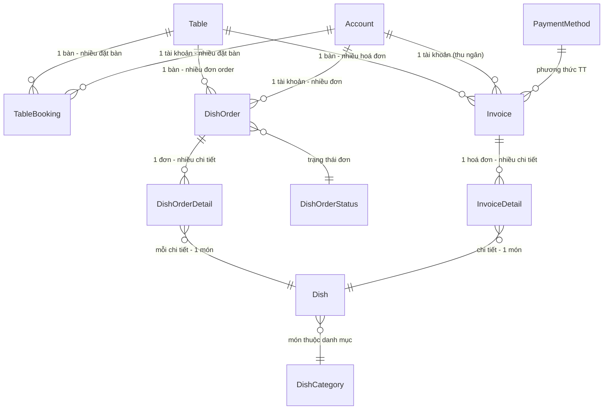
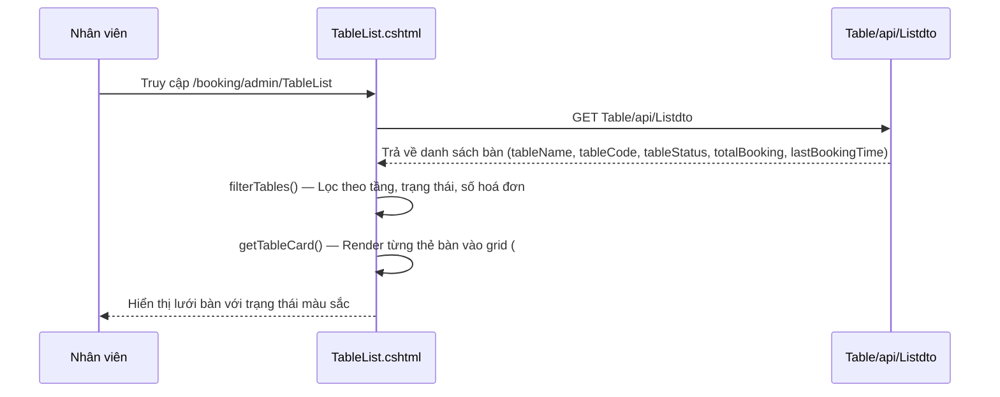
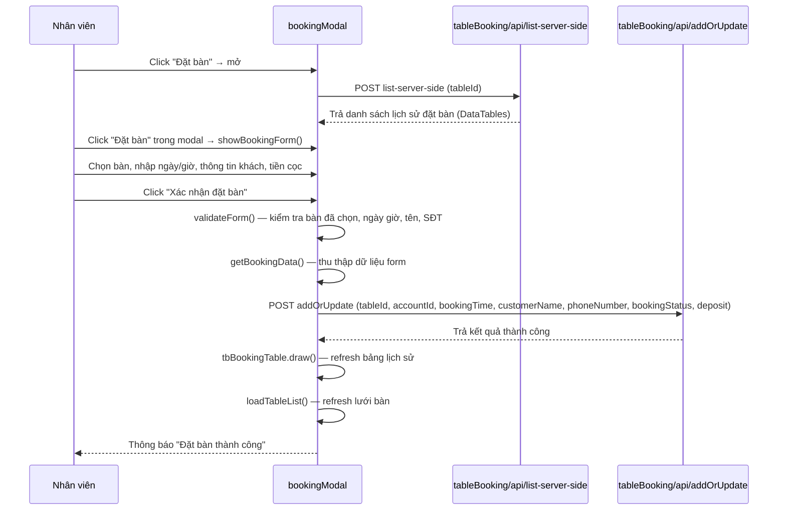
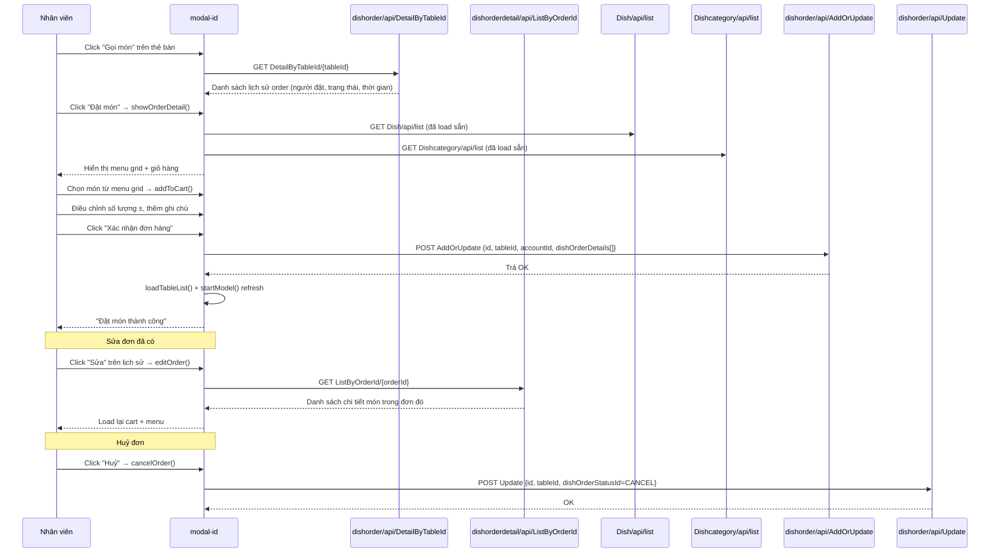
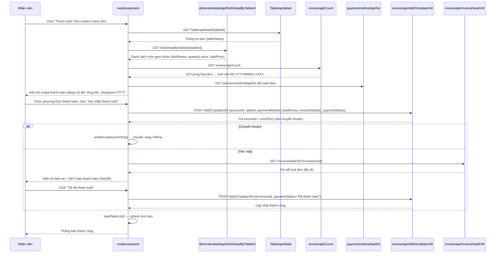
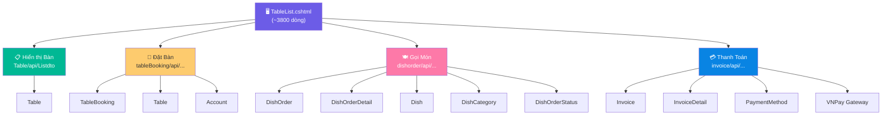

# Báo Cáo Phân Tích Màn Hình `/booking/admin/TableList`

Báo cáo phân tích toàn diện giao diện quản lý bàn – là màn hình trung tâm điều phối các hoạt động: hiển thị bàn, đặt bàn, gọi món, và thanh toán.

> [!NOTE]
> **File View chính:** [TableList.cshtml](file:///d:/.DATN/cafe-management/CfCRM.DATN/CoffeeCRM.View/Views/Booking/TableList.cshtml) (~3797 dòng)
> **Route:** `GET /Booking/admin/TableList` — Controller: [BookingController.cs](file:///d:/.DATN/cafe-management/CfCRM.DATN/CoffeeCRM.View/Controllers/Coffee/BookingController.cs)

---

## Phần 1: Tổng Hợp Toàn Bộ API Được Sử Dụng

### Bảng tổng hợp API

| # | API Endpoint | Method | Controller Backend | Bảng DB tham gia | Chức năng |
|---|---|---|---|---|---|
| 1 | `Table/api/Listdto` | GET | `TableController` | **Table**, TableBooking | Lấy danh sách tất cả bàn kèm trạng thái (available/occupied/booked), tổng số booking, thời gian booking gần nhất |
| 2 | `Table/api/detail/{id}` | GET | `TableController` | **Table** | Lấy chi tiết thông tin 1 bàn (tableName, tableCode…) |
| 3 | `tableBooking/api/list-server-side` | POST | `TableBookingController` | **TableBooking**, Table, Account | Phân trang server-side danh sách lịch sử đặt bàn (DataTables), lọc theo `tableId` |
| 4 | `tableBooking/api/addOrUpdate` | POST | `TableBookingController` | **TableBooking** | Tạo mới hoặc cập nhật thông tin đặt bàn (ngày/giờ, khách hàng, trạng thái, tiền cọc) |
| 5 | `dishorder/api/DetailByTableId/{tableId}` | GET | `DishOrderController` | **DishOrder**, DishOrderStatus, Account | Lấy danh sách các đơn đặt món theo bàn (lịch sử order) |
| 6 | `dishorder/api/AddOrUpdate` | POST | `DishOrderController` | **DishOrder**, **DishOrderDetail**, Dish | Tạo / Cập nhật đơn đặt món kèm danh sách chi tiết các món |
| 7 | `dishorder/api/Update` | POST | `DishOrderController` | **DishOrder** | Cập nhật trạng thái đơn đặt món (VD: huỷ đơn) |
| 8 | `dishorderdetail/api/ListByOrderId/{id}` | GET | `DishOrderDetailController` | **DishOrderDetail**, Dish | Lấy danh sách chi tiết món trong một đơn đặt cụ thể |
| 9 | `dishorderdetail/api/DishDetailByTableId/{tableId}` | GET | `DishOrderDetailController` | **DishOrderDetail**, DishOrder, Dish | Lấy tổng hợp các món đã đặt (gom nhóm) theo bàn → phục vụ thanh toán |
| 10 | `Dish/api/list` | GET | `DishController` | **Dish** | Lấy toàn bộ danh sách món ăn (hiển thị menu grid trong modal gọi món) |
| 11 | `Dish/api/Search` | POST | `DishController` | **Dish** | Tìm kiếm món ăn theo từ khóa (Select2 autocomplete) |
| 12 | `Dishcategory/api/list` | GET | `DishCategoryController` | **DishCategory** | Lấy danh sách danh mục món (tab filter trong modal gọi món) |
| 13 | `paymentmethod/api/list` | GET | `PaymentMethodController` | **PaymentMethod** | Lấy danh sách phương thức thanh toán (dropdown trong modal thanh toán) |
| 14 | `invoice/api/Count` | GET | `InvoiceController` | **Invoice** | Đếm tổng số hoá đơn → sinh mã hoá đơn tự động |
| 15 | `invoice/api/AddOrUpdateVM` | POST | `InvoiceController` | **Invoice**, **InvoiceDetail**, Table | Tạo hoá đơn thanh toán mới kèm chi tiết (hoặc cập nhật trạng thái "Đã thanh toán") |
| 16 | `invoice/api/InvoiceDetailVM?invoiceId={id}` | GET | `InvoiceController` | **Invoice**, InvoiceDetail, Account | Lấy chi tiết hoá đơn sau khi tạo → hiển thị biên lai + QR thanh toán |

### Tổng hợp các Bảng (Database Tables) tham gia



| Bảng | Vai trò |
|------|---------|
| **Table** | Chứa thông tin bàn (tên, mã, trạng thái, sức chứa) |
| **TableBooking** | Lịch sử đặt bàn (khách, thời gian, trạng thái, tiền cọc) |
| **DishOrder** | Đơn đặt món gán theo bàn + nhân viên |
| **DishOrderDetail** | Chi tiết từng món trong đơn (dish, số lượng, giá) |
| **DishOrderStatus** | Bảng tra cứu trạng thái đơn (Processing, Done, Cancel) |
| **Dish** | Danh sách món ăn/đồ uống |
| **DishCategory** | Danh mục phân loại món |
| **Invoice** | Hoá đơn thanh toán tổng |
| **InvoiceDetail** | Chi tiết từng dòng trên hoá đơn |
| **PaymentMethod** | Phương thức thanh toán (Tiền mặt, Chuyển khoản…) |
| **Account** | Tài khoản nhân viên (người đặt, thu ngân) |

---

## Phần 2: Phân Tích Các Luồng Nghiệp Vụ

### 2.1. Luồng Hiển Thị Danh Sách Bàn



**Chi tiết:**
- Khi trang load xong, gọi `loadTableList()` → AJAX GET tới `Table/api/Listdto`.
- Dữ liệu trả về được lưu vào biến `allTables` / `allTableOrigins`.
- Hàm `filterTables()` lọc bàn theo 3 tiêu chí:
  - **Tầng** (parse từ `tableCode`: `TB-1xx` = tầng 1, `TB-2xx` = tầng 2…)
  - **Trạng thái bàn**: `available` (trống), `occupied` (đang sử dụng), `booked` (đã đặt)
  - **Số hoá đơn**: có hoặc không có booking
- Hàm `getTableCard()` sinh HTML card cho mỗi bàn, bao gồm nút **Gọi món** và **Đặt bàn** hiển thị khi hover.
- Khi click vào bàn, hiện context menu với 5 hành động: *Đặt món, Đặt bàn, Chọn bàn, Làm trống, Thanh toán*.

---

### 2.2. Luồng Đặt Bàn (Table Booking)



**Chi tiết:**
- Modal `#bookingModal` hiển thị 2 giao diện chuyển đổi:
  - **Lịch sử đặt bàn** (DataTables server-side phân trang)
  - **Form đặt bàn mới** (khi click "Đặt bàn")
- Form đặt bàn cho phép:
  - Chọn bàn từ grid hiển thị (có badge trạng thái: available/booked/occupied)
  - Lọc bàn theo tầng và số người
  - Nhập ngày, giờ (Flatpickr), tên khách, SĐT, ghi chú
  - Tuỳ chọn đặt cọc (toggle on/off, nhập số tiền)
  - Chọn trạng thái: Chờ xác nhận / Đã xác nhận / Đã huỷ
- Tại bảng lịch sử, có 3 nút thao tác trên mỗi dòng booking `confirmed`:
  - **Sửa** (`editBooking`) → load lại dữ liệu vào form
  - **Huỷ** (`updateStatus(id, "cancelled")`) → gọi API `addOrUpdate` cập nhật status
  - **Xác nhận** (`updateStatus(id, "completed")`) → chuyển sang hoàn thành

---

### 2.3. Luồng Gọi Món (Dish Order)



**Chi tiết:**
- Modal `#modal-id` chia làm 2 tab chính chuyển đổi qua lại:
  - **Tab 1 — Lịch sử đặt món** (`#tableOrderHistory`): DataTables client-side, hiện danh sách order (người đặt, trạng thái, thời gian). Mỗi dòng có nút Sửa/Huỷ.
  - **Tab 2 — Chi tiết đặt món** (`#tableOrderDetail`): Layout 2 cột:
    - *Cột trái (65%):* Menu grid với hình ảnh, nút filter category, tìm kiếm.
    - *Cột phải (35%):* Giỏ hàng với tổng tiền, nút tăng/giảm số lượng, ghi chú, áp mã giảm giá.
- Dữ liệu món ăn và danh mục được load sẵn lúc trang khởi tạo.
- Khi xác nhận đơn, gọi `dishorder/api/AddOrUpdate` với payload gồm:
  ```json
  {
    "id": 0, // 0 = tạo mới, > 0 = cập nhật
    "tableId": <id bàn>,
    "accountId": 0, // backend lấy từ token
    "dishOrderStatusId": 0,
    "dishOrderDetails": [
      { "id": 0, "quantity": 2, "dishId": 5, "note": "", "dishOrderId": 0 }
    ]
  }
  ```
- Giỏ hàng (cart) đồng bộ song song với DataTable ẩn `#tableDataProduct` để đảm bảo tương thích ngược.

---

### 2.4. Luồng Thanh Toán (Payment / Invoice)



**Chi tiết:**
- Hàm `startInvoice(tableId)` chuẩn bị modal thanh toán:
  - Gọi `dishorderdetail/api/DishDetailByTableId` để lấy **tổng hợp** các món đã order cho bàn đó (gom lại từ nhiều đơn).
  - Gọi `Table/api/detail` để lấy tên bàn.
  - Sinh mã hoá đơn tự động: `HD-YYYYMMDD-XXXX`.
  - Auto-fill thông tin nhân viên từ `localStorage.profile`.
- Khi xác nhận thanh toán:
  - Gọi `invoice/api/AddOrUpdateVM` với `paymentStatus: "Chờ thanh toán"`.
  - Nếu phương thức là **Chuyển khoản** → redirect sang VNPay.
  - Nếu phương thức là **Tiền mặt** → hiển thị biên lai SweetAlert2 kèm **QR Code** (VietQR, ngân hàng Vietcombank).
  - Sau khi nhân viên xác nhận đã thu tiền → gọi lại API cùng endpoint để update `paymentStatus: "Đã thanh toán"`.

---

### 2.5. Luồng Phụ: Chọn Bàn / Làm Trống Bàn

| Hành động | Mô tả | API gọi |
|-----------|-------|---------|
| **Chọn bàn** (`selectTable`) | Chuyển trạng thái bàn từ `available (1)` → `occupied (0)` | `GET Table/{id}` + `PUT Table/{id}` |
| **Làm trống** (`makeAvailable`) | Chuyển trạng thái bàn từ `occupied (0)` → `available (1)` | `GET Table/{id}` + `PUT Table/{id}` |

> [!IMPORTANT]
> Các hàm `selectTable()` và `makeAvailable()` hiện tại **được khai báo trong** [TableBooking.cshtml](file:///d:/.DATN/cafe-management/CfCRM.DATN/CoffeeCRM.View/Views/Booking/TableBooking.cshtml) (trang khác), nên khi gọi từ TableList có thể bị lỗi `function not defined` nếu không share layout đúng cách. Cần kiểm tra lại.

---

## Phần 3: Tóm Tắt Kiến Trúc Tương Tác



Tổng cộng màn hình sử dụng **16 API endpoints** liên kết với **11 bảng Database** chính, phục vụ 4 luồng nghiệp vụ cốt lõi của quán cà phê.
